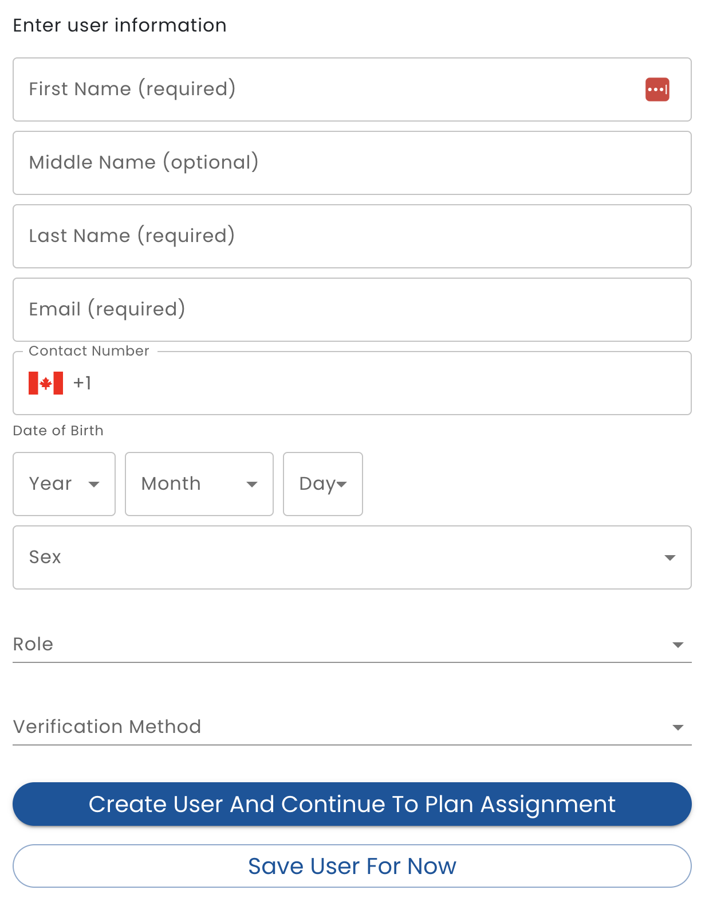

# Add a Person

To add a person, click the + button on the lower right of the people list.

* **User Type** - Select *Admin* if the new person requires access to admin functions, such as adding people, *Staff* if the person works for your organization and *User* if person receives services from your organization. 
* **Verification Type** - Verification methods are configured for your organization in Verid (See [Verifications](/verid/using-verid/verifications/) for  more details.)  Typically there is an option for *Self Declared* if there no verification has been performed. Or, if you have regular interactions with a person and are aware of who they are, there is typically a *Personal Knowledge* verification type.  Other verification types require that an automated or manual process be performed in order to verify the person's identity.

Note that only people who are an **Admin** user type in their organization are able to add people.
