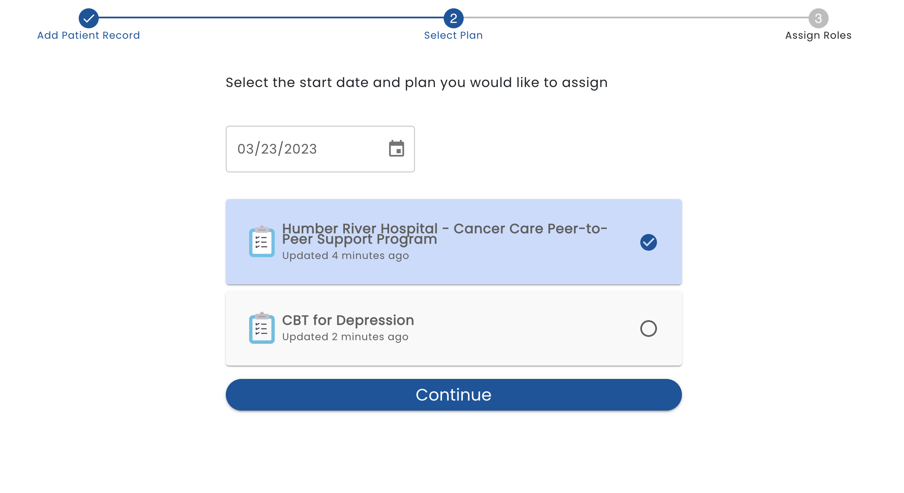

# Assign Care Plan

If *Create User and Continue to Plan Assignment* is selected when creating adding a person or *Assign New Care Plan* is selected from the user's profile screen, the plan and start date must be selected.

Note that only Active (published) plans are available to be selected and the most recent published version of the plan is used.
