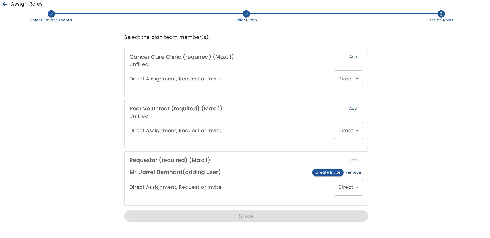
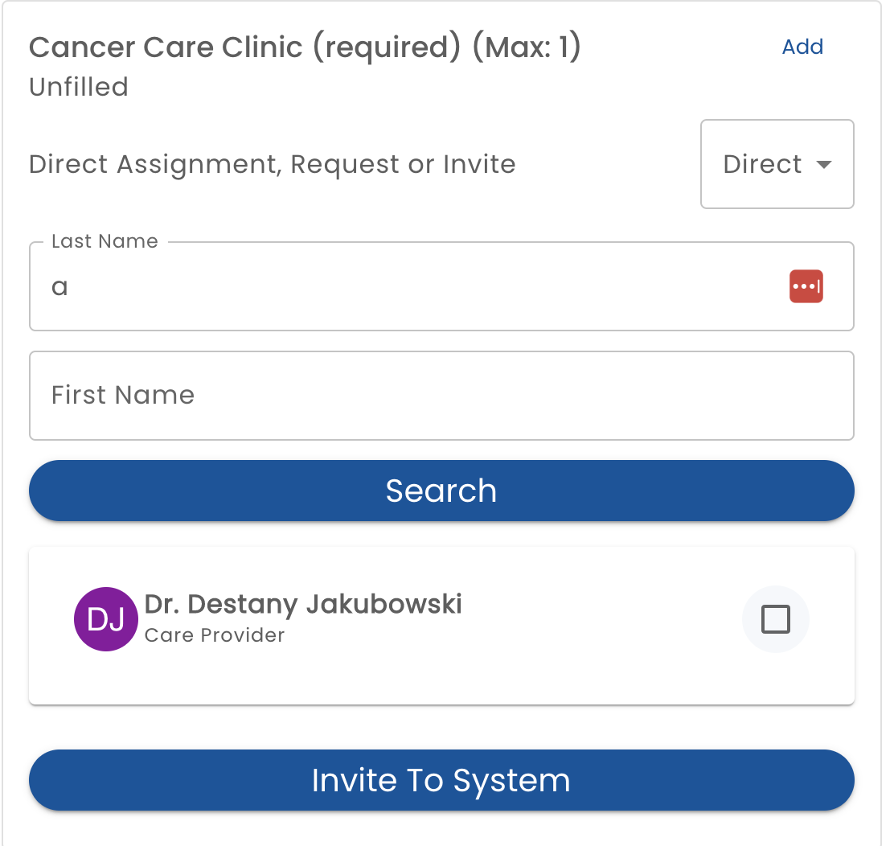

# Assign Roles

The third step of the add person wizard, or the response to the Edit Roles button from a user's profile page displays the Role Assignment editor.

The roles that are available to be assigned are defined in the [Roles](/creating-plans/roles) section of the plan template.  The role configuration also determines if one or more people can be assigned to the role and if the role must be filled or may be left empty.

A person can be *Directly* assigned the role.  No further steps are required. 

A person can be *Invited* to the role.  The user will be notified of the invitation and can accept or decline to be in the role.

A person can *Request* to be in the role.  The primary user of the plan must accept the person's involvement.

In order to be assigned to the role, the person must already have an account on Healix and must have the correct user type.  For example, if the role was defined to require Staff user type, then the person must also be assigned that status.

To find a user for a role, enter a few letters of their first or last name and select search and then select the user you are looking for.

