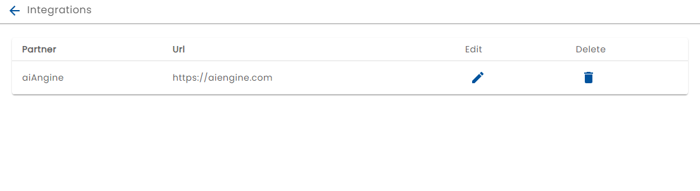
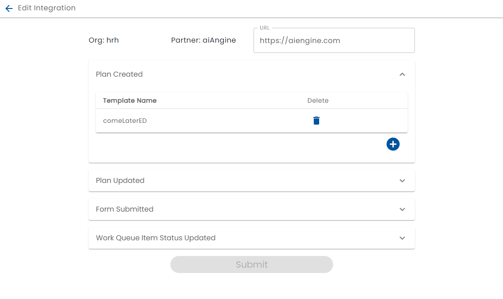

# Configuring HTTP Integrations

[Integrations](../integration/) allow the system to exchange information with a third party system through the use of a publish subscribe mechanism. As well as using the Pub/Sub NATS API, administrators may also configure HTTP posts and hooks for the integrations.

To configure HTTP Integrations, select Manage HTTP Integrations from the Admin console. A list of configured integrations is displayed:

New HTTP integrations can be added with the (+) button and an existing HTTP integration configuration can edited.

The integration configuration allows the configuration of:

* The target URL
* The [Templates](../creating-plans/) that trigger HTTP posts
* Which events should be sent
* Which Form Submissions of the template should be sent
* Which Work Queues events should be sent

