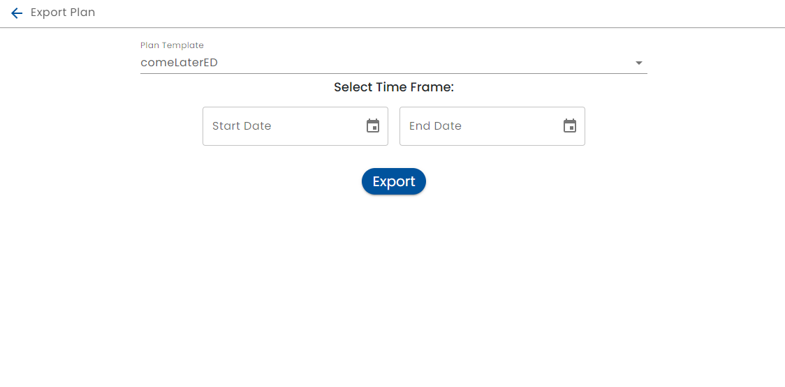

# Exporting Plan Data

In order to support data analysis, an administrator can export all the data associated with a plan.

Navigate to Export Plan on the Admin panel and select "Export Plan Data".

Select the plan to export and, if applicable the date range.  Using a date range can limit the amount of data being exported to have smaller file sizes, incremental changes or if the system does not have enough time to export all data.

The format of the file produced is [JSON lines](https://jsonlines.org/).
