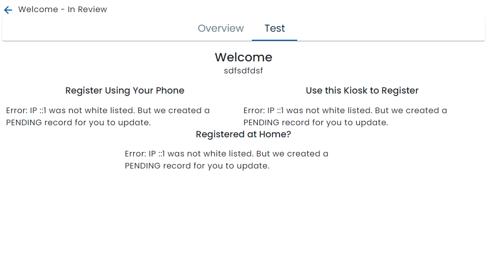

# IP White Listing / Locking

In order to protect the privacy of organizations using [Public Devices](../../public-devices/) or [Work Queue Displays](../../work-queue-display/), and to prevent bad actors from maliciously using the public device URL, the public device page and work queue display are only allowed to run on devices at IP addresses that have been added to a white list.

The first time the public device or work queue display is accessed, either on a kiosk or in test mode, an error screen will be displayed.

As well as denying access to the page, the system also creates a limited number of records in the whitelist table of PENDING status.  This simplifies the whitelisting process avoiding having to know and type the IP address in order to unblock it.

