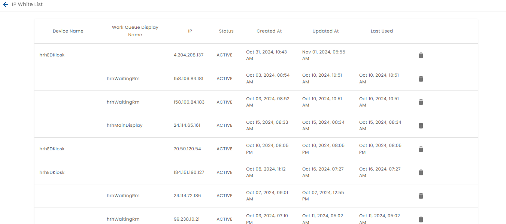

# IP White List

The IP White List is available from the Administration menu and linked from the Overview tab of [Public Device](../creating-public-devices/edit-public-device) editor.

When the Public Device is accessed from an IP that is not in the white list, a row is added with the IP address that was blocked. To allow the public device to work from that IP Address, simply click the Activate button.

Do not click the Activate Button on IP addresses that were not created intentionally (e.g. testing the Public Device configuration or accessing it from the actual device.)

Note that only three PENDING records will be created for any given device.
