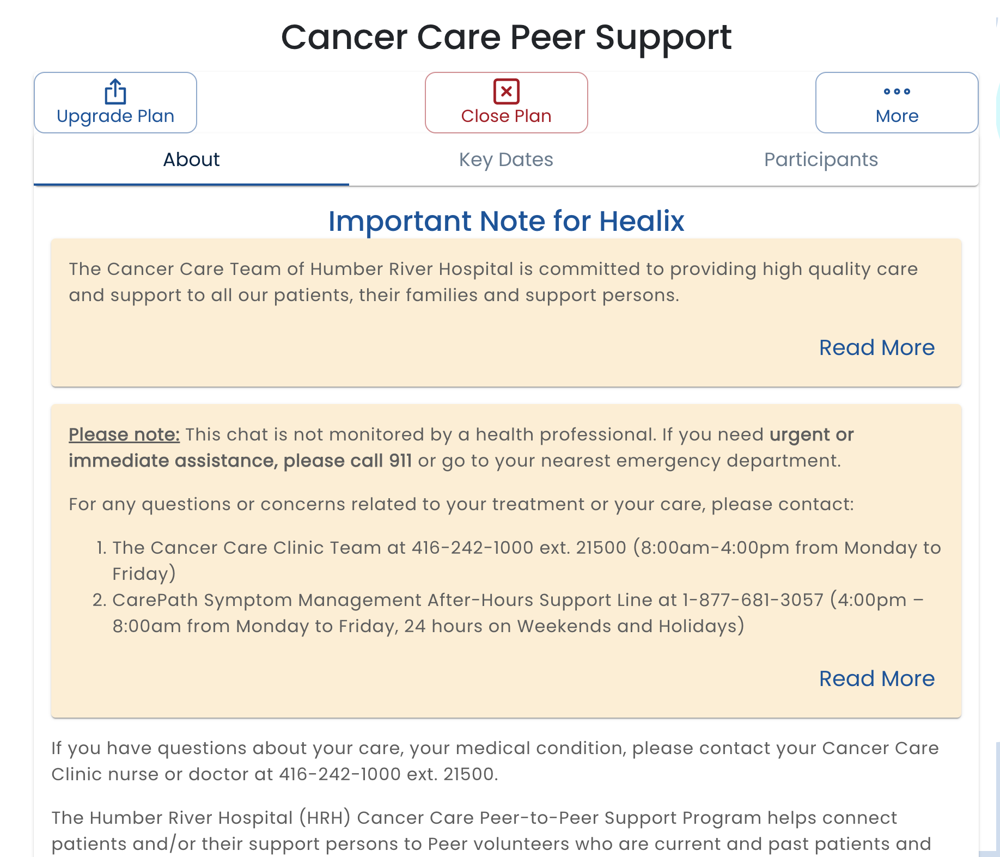

# Plan Details

The **Plan Details** page displays detailed information about the user's plan and lets administrators manage the plan.

:::note

The features available on the user profile depend on your privileges.  Many of the features described are only available to admins.  In particular, the **Upgrade Plan** and **More** (which leads to **View Data** and **Edit Roles**) are only available to admins.

:::

* **About**: The About tab displays a description of the plan.  The text is configured in the [Plan Template](/creating-plans)
* **Key Dates**: The Key Dates tab displays import dates such as the start date of the plan, the expected end date and other dates configured by the template
* **Participants**: The Participants tab shows the people that are assigned to the roles and a description of the role that has been configured in the plan template.

Actions that can be performed include:

* **Upgrade Plan**:  The Upgrade Plan button is used when a new version of a plan has been published and the user requires to run the new version.  Unlike the **Update Plans** available on the Template List that runs the upgrade for all users, this command only upgrades the plan for the current user.
* **Close Plan**: The Close Plan button will close the plan.  A closed plan:

  * Will not accept new form submissions or chat messages
  * Will still appear in the plans list (with a Closed tag)
  * Educational material assigned by the closed plan will still be available in the library

