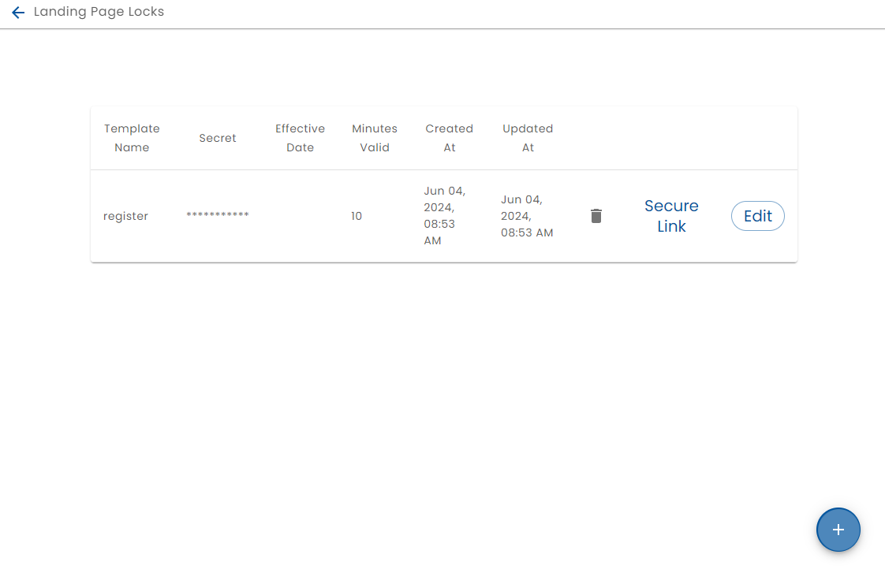
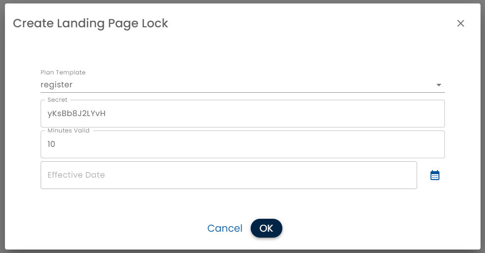

# Plan Landing Page Locks

The **Plan Landing Page Locks** page in the Administration panel allows you to control who is able to access the landing page of a plan.

When a [Plan Landing Page](../creating-plans/presentation/landing-page/) is configured, it creates a publicly accessible URL. Because it is publicly available, it may be beneficial to prevent uninvited users or bots from using the page and creating garbage data.

When a locked landing page is navigated to without an correct token in the URL, a lock page is displayed.


A signed URL (one with a valid key) can be generated three ways:

* *From the Landing Page admin screen* - this allows "Invite only" plans.  The link that is generated only lasts the configured amount of time,
* *From a [Public Device](../public-devices/)*.  The links that the public device generate are signed and the QR Codes on the device rotate every minute.
* *A Third Party App*. A secure handoff between another app and Healix can be configured.

To administer the locks go to the Administration panel and select Landing Page Locks.



Click the + button to create a lock for a plan landing page or click the Edit button to modify the lock.  The Secure Link button generates a secure URL which can be sent to a user.



* *Plan Template* Select the [Plan](../creating-plans/) to lock
* *Secret* - A random string that is used to generate tokens
* *Minutes Valid* - How long the signed URL is valid for. If you are emailing the signed URL, then consider the workflow process. For example, one day would provide the recipient a day to complete the landing page tasks.  If the landing page is accessed from a [Public Device](../public-devices/), a much shorter time, e.g. 10 minutes would be more secure
* *Effective Date* - When this particular secret comes into effect.  If signed URL is being used as a way for a third party app to securely hand off to Healix, Effective Date can be used to manage key rotation

## Secure Hand-off With Third Party Apps

Healix can be used as a part of a workflow using different products.  An app can launch Healix by simply directing a user to a [Plan Landing Page](../creating-plans/presentation/landing-page).

The problem is that the plan landing page is public and it may be required that users complete the prior steps in the flow involving a third party app.

In order to do this, the calling app can generate a signed URL with the shared secret.  

The following is example code, in Typescript node for doing so:

```
import { differenceInSeconds, parseISO } from 'date-fns';
import { createHmac } from 'crypto';

export interface SecureTimestamp {
  timestamp: string;
  hmac: string;
}

export interface TimestampValidation {
  valid: boolean;
  ageInSeconds: number;
  timedOut: boolean;
}

export interface HmacSecret {
  secret: string;
  minutesValid: number;
}


export class SecureTimestampService {
  public static generateSecureTimestamp(secretKey: string, atTime: Date = new Date()): SecureTimestamp {
    const timestamp = atTime.toISOString(); // Get current UTC timestamp in seconds
    const hmac = createHmac('sha256', secretKey).update(timestamp).digest('hex'); // Generates HMAC in hexadecimal format
    return { timestamp, hmac };
  }

  public static validateTimestamp(args: {
    receivedTimestamp: string;
    receivedHmac: string;
    hmacSecret: HmacSecret;
    currentTime?: Date;
  }): TimestampValidation {
    const { receivedTimestamp, receivedHmac, hmacSecret } = args;
    const currentTime = args.currentTime || new Date();
    const minutesValid = hmacSecret.minutesValid;
    const logger = Logger.newLogger(undefined, 'LandingPageSecretService.validateTimestamp');
    const hmac = createHmac('sha256', hmacSecret.secret).update(receivedTimestamp).digest('hex');
    const valid = hmac === receivedHmac; // Returns true if HMACs match
    const ageInSeconds = differenceInSeconds(currentTime, parseISO(receivedTimestamp));
    const timedOut = ageInSeconds > minutesValid * 60;
    return { valid, ageInSeconds, timedOut };
  }
}

```


