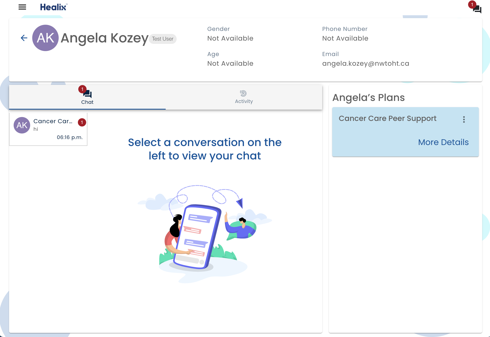

# User Profile

To access a person's profile page, click on their name in the People tab.

:::note

The features available on the user profile depend on your privileges.  Many of the features described are only available to admins.

:::

* The **Assign New Plan** button leads to the [Assign Care Plan](./assign-care-plan) screen and will allow a new plan to be assigned to the current user.
* A list of **Current Plans** is also displayed.  To configure a plan for the user click on the **More Details* button plan card.  See [Plan Details](plan-details) for more information.

