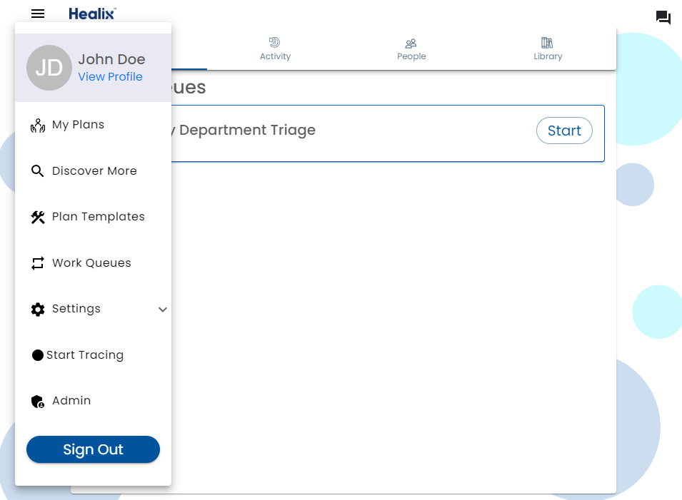
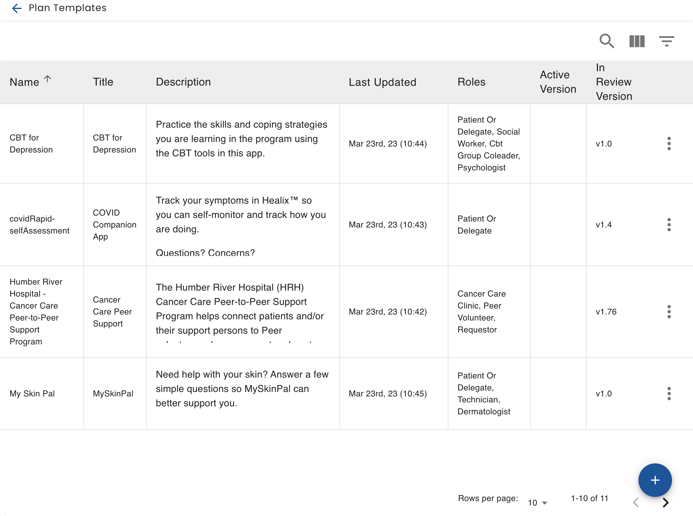

# Getting Started

Templates define all the screens, rules and presentations that make up a plan.  Think of a plan, like an app.  The template editor allows to you create or modify an app by editing the screens that are shown to users and the conditions under which they are shown.  In many cases, determining the conditions that users are shown is done with simple check boxes and drop downs. There is a rules editor that allows for more complex conditions to be defined.  There is also a simulator that allows you to test the plans.

To navigate to a list of templates, choose the menu at the upper left of the screen, and select Plan Templates.

Then, to add a new template, by clicking the floating + at the bottom right

