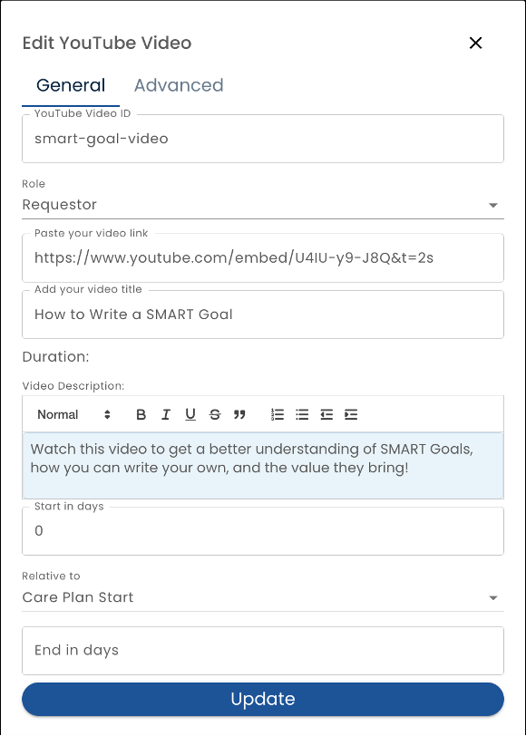

# Education

The *Education* tab allows the creation of education form assignments.

Education assignments are really the same as [Form Assignments](./forms-and-fields/form-assignment-editor) under the hood.  You'll see that many of the same settings are available for both and the [Form Assignments](./forms-and-fields/form-assignment-editor) documentation can be referenced.

Education assignments differ in that the form assignments are displayed in the user's Library tab and not the Home tab.

The other difference is creating Youtube and External Links is greatly simplified for the content manager.  Rather than creating forms from scratch, content managers can just fill in the blanks.

## Typography Guidelines (YouTube Video)

In order to appear consistent with other parts of the system, use the following styles:

* Video Description: **Normal** (in the style dropdown)

