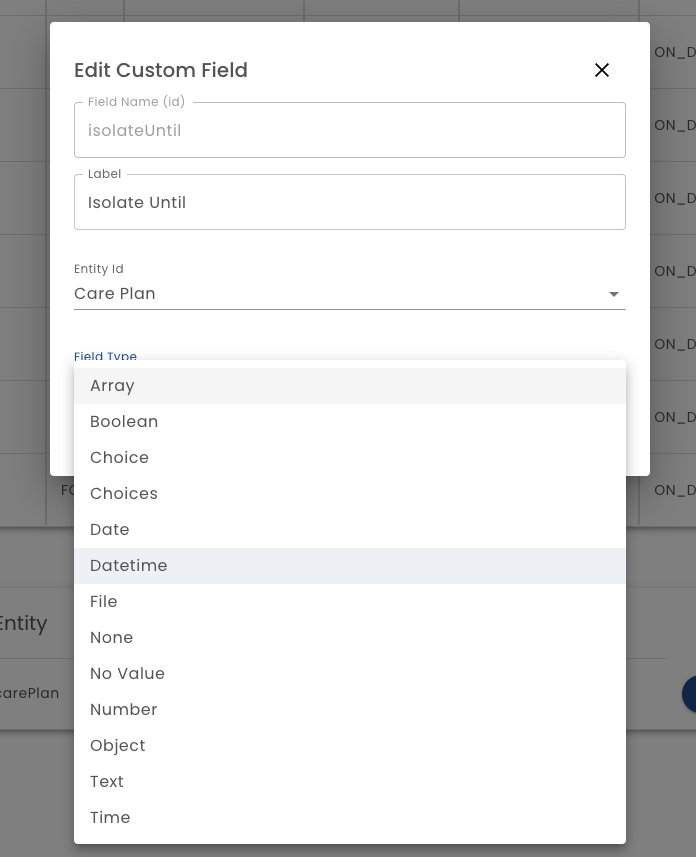

# Custom Fields

Custom Fields are values that can be set by rules that you create in the rules editor. 

**Entity Id** - Select the  [Entity](/docs/glossary#Entity) that you wish to add the field to.

**Field Type** - Choose the field's data type (e.g. Date, Text, Number etc.)

:::tip

Values are added to a *Custom Field* by defining [Rules](../rules)