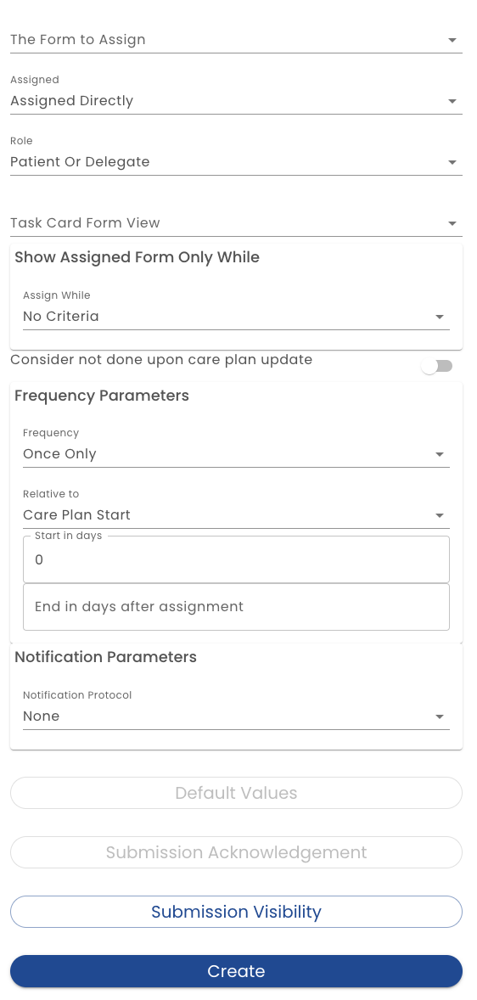

# Form Assignment Editor

**Form to Assign** - The first attribute is to identify the form that shall be assigned.  The drop down gives you a list of forms.  Currently, the form referenced must be created in the Forms panel accessed from outside the template editor.  However, this will be changing shortly. See the [roadmap](/docs/roadmap#template-scoped-forms) for details.

**Assigned** - The Assigned attribute identifies if the form will be immediately assigned or if the form is assigned as a result of a rule firing.

**Role** - This dropdown allows you to select one of the roles defined on the [Roles](/docs/creating-plans/roles/roles-list).

**Task Card View** -  Sometimes it is desirable to edit how a task card is displayed on the task list for an end user.  By default the form name is used.  If other text is required, then a form view can be specified.

**Show Task Only While** - As an alternative to more complex and powerful rules, this section provides a simple dropdown to control when the form is assigned (i.e. the task given to) a user.  

* By default, *No Criteria* is selected.  This means the task will show up immediately (unless limited by the frequency parameters below)
* When *Field Equal to Value* is selected, two additional fields must be completed:
  * The *While* field dropdown allows you to select a field from the [Dynamic Data Model](../../dynamic-data-model/data-model-intro)
  * The *Value to Compare* field allows you to enter a value. When the value of field specified in the *While* dropdown is equal to the value entered here, the task will be displayed
* When *Field Not Equal to Values is selected, the behavior is the same as *Field Equal to Value* except, the condition for the task be displayed is when the value does equal the field
* *Expression is True* allows you to enter and arbitrary boolean [expression](/docs/dynamic-data-model/expressions) using the *[Healix Expression Grammar](/docs/dynamic-data-model/healix-calculation-grammar)*.

**Consider not done upon care plan update** - This setting controls when a task re-appears. When set to true, changing the an attribute of the plan, such as the risk status, status, end date or any [Custom Field](./custom-fields) will cause the task to reappear if it was being suppressed due to it being already submitted.  For example, if the Frequency is set to *Once Only*, the task will not show after the user submits that form and *Consider not done upon care plan update* is off. However, if *Consider not done upon care plan update* is on, then a change to a plan attribute will cause the task to re-appear.

**Frequency Parameters** - As an alternative to more complex and powerful rules, the Frequency Parameters provides a few simple drop downs to control when a form assignment (task) is displayed to a user.

**Frequency** - This determines when the task is shown to the user

* *Once Only* - The task is displayed once and then will not be displayed after it has been submitted
* *On Demand* - The task is always available, even after it has been submitted
* *Daily* - The task is displayed every day.  After it has been submitted, it will not appear for the remains of the day.  If the user does not complete the task, it will still only show up once.  There is no expectation of backfilling or catching up.
* *Weekly* - Like *Daily* except, once per week.

**Relative to**, **Start in Days** **End in Days** - These settings control a window of time when the task is displayed.  The *Relative To* field lets you chose an anchor date. You may chose "Plan Start Date" or "Plan End Date". If *Start in Days* is set to 0, then the task is immediately shown if the anchor is "Plan Start Date".  Otherwise, it is delayed for the specified number of days.  If "Plan End Date" is selected, a negative number indicates how many days before the plan end the task should be displayed.

**Notification Parameters** - The *Notification Parameters* control how the task is displayed.

* *None* - The task appears normally in the task list
* *Tracked* - A email notification can be configured when the task is assigned 
* *Important* - A email notification can be configured when the task is assigned 
* *Urgent* - When the task is assigned, the form is displayed in a way that takes over the application.  The form must be submitted by the user before any other actions are taken
* Notes: In App notifications, delayed notifications and SMS are not yet implemented

**Default Calculations** - An initial value can be computed to pre-fill a field with an [expression](/docs/dynamic-data-model/expressions)

When a form is prepared for the end user to complete, calculations are performed to compute pre-filled values.  Note that this is different from default values defined in the form editor because values can be computed from previous form submissions using the  [Healix Expression Grammar](/docs/dynamic-data-model/healix-calculation-grammar).

When you click the *Default Calculations* button.  A list of calculations is displayed (if any).  You can add a new *Default Calculation* by clicking the *Add* button or editing an existing one by clicking on the row.

When editing a calculation, you have a dropdown to select the field value being computed and the [expression](/docs/dynamic-data-model/expressions) editor to compute the expression.

**Submission Acknowledgement** - This allows you to control if a [toast](/docs/glossary#toast) is displayed when a form is displayed and what the text is.

**Submission Visibility** - This allows you to control who can see the related form submissions.  For example, if a user submits a form, it may be necessary to hide the form from other users.  When clicked, you can control the following settings:

* *Announce that the submission occurred* - It may be useful to the plan participants that they know that a task has been completed.  If so, set this to on and a message will appear in the chat channel.  
* *Visibility* - Select all the roles that will be able to see the submitted forms.  If you leave this blank, no participants will be able to see the submissions.
  
  

