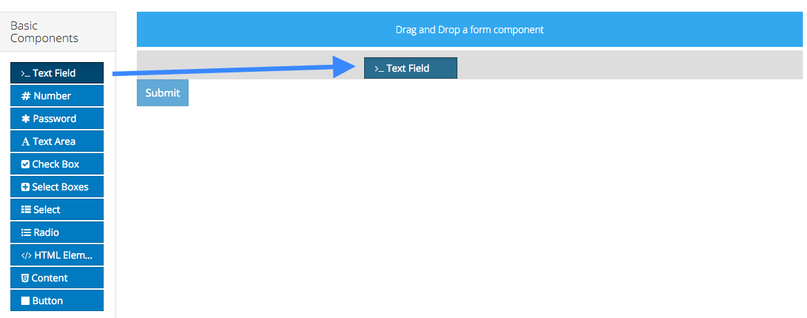

# Adding a Form Component

To add a form component to a form, drag and drop the component from the left column into the desired location within the form.

Each new form starts with a submit button automatically added to it. This can be removed or edited as necessary.

