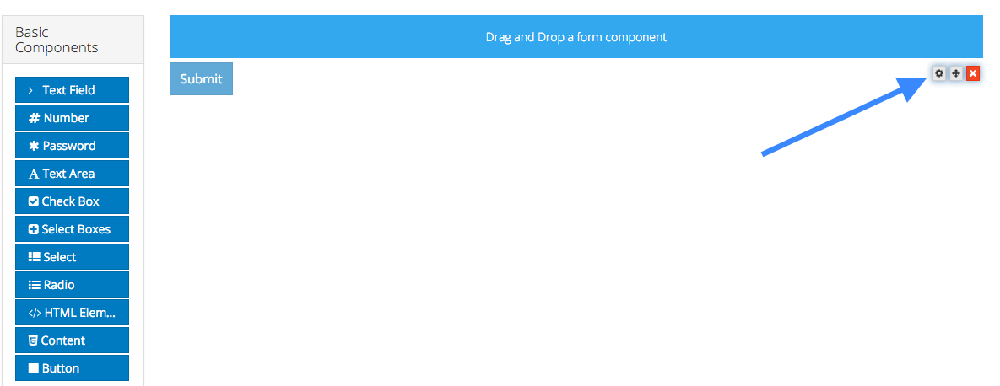

# Editing a Form Component

To edit a form component on a form, hover over the component and click the gear icon. You will then be presented with a settings form for the component.

The settings for a form component are different for each component type.
