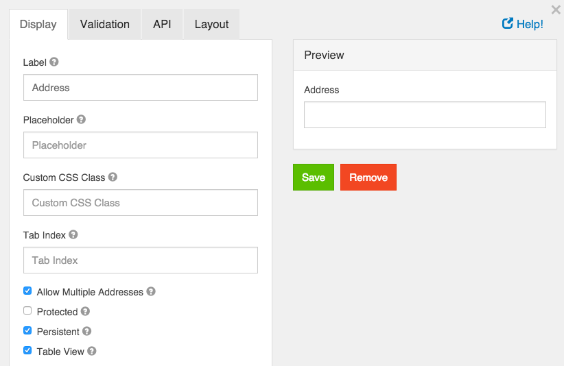
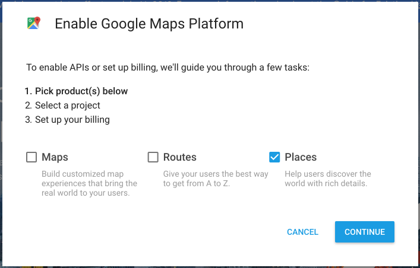
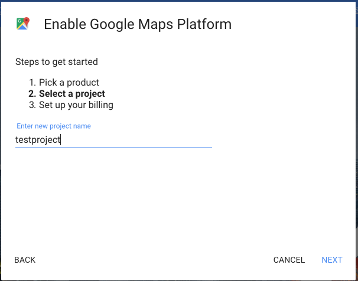
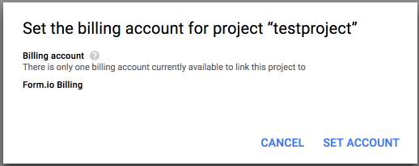
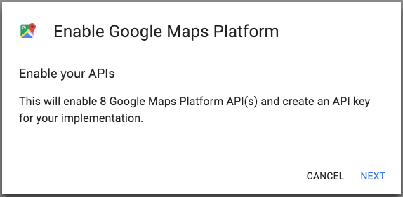
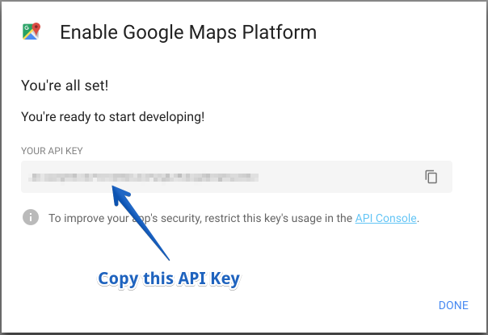
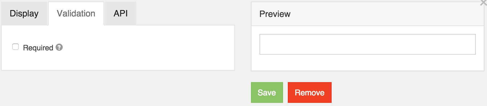

# Address

> Important Notice With recent changes to the Google GeoCode API usage policy, you are now required to provide the Google GeoCode API key along with the configuration for the Address component. Please see the section below on how to setup and configure this within your Google account.

The address form component is a special component that does lookups for addresses entered. It can be entered in free form and will save the address as well as geolocation and other information.

## Google Maps API Key

Due to recent changes to the Google Geocode API usage policies, this is now required for all Address components. To setup an API key, you must follow the following directions.

- First, go to https://cloud.google.com/maps-platform/ and then click on the button that says Get Started

- Next, click on the button that says Places\* and then press Continue
  

- On the next page, click the dropdown and select + Create new project (note, if you already have a project, then just select it) and then give your project a name, then click Next

- Now that you have a project created, you can then setup Billing for that project by clicking on Set Account on the billing modal. If you selected an existing project, you will not see this page.

- If you created a new project, you will then need to provide a payment mechanism so that Google can charge for your usage of their GeoCode API.

- On the next modal, you will then click Next to enable the Mapping API’s needed for the Address compoennt.

- The next modal will then show you the API Key that you need to use for this field in the Address component.

You will then paste this API key into the place on the Address component modal that says Google Maps API Key.

## Label

The label for this field that will appear next to it.

## Placeholder

The placeholder text that will appear when this field is empty.

## Custom CSS Class

A custom CSS class to add to this component. You may add multiple class names separated by a space.

## Tab Index

Sets the tabindex attribute of this component to override the tab order of the form. See the MDN documentation on tabindex for more information on how it works.

## Allow Multiple Addresses

Allow multiple addresses to be entered into the field.

## Unique

If checked, this field will be enforced as unique for this form. Submissions will be checked to see if an existing value matches. This validation is currently server side only.

## Protected

If checked, this field is for input only. When being queried by the API it will not appear in the properties and also should not appear in exported data. You won’t be able to see the value on form.io, but it will be stored in database under the hood.

## Persistent

If checked, the field will be stored in the database. If you want a field to not save, uncheck this box. This is useful for fields like password validation that shouldn’t save.

## Table View

If checked, this value will show up in the table view of the submissions list.

## Required

If checked, the field will be required to have a value.
