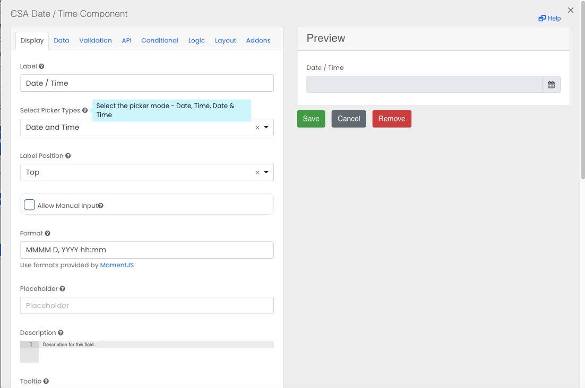

# CSA Date / Time

The CSA Date/Time component allows users to add a date picker, time picker or date and time picker to a form. It also includes additional validation options (under the Validation tab), constraining the user-selected date to be within a specific range.
 

## Select Picker Type
Select a picker mode - Date,Time, Date & Time.

## Select Date Limits

Set validation limits. Default is ‘any date’ (no limits), and can pick before or after the current date.

## Select Date Units

Select the duration units for the validation (hours, days, weeks, months). 

## Specify number of days etc.

Set the number of hours/days/weeks/months before or after the current date. The user selected date must be within this range.

