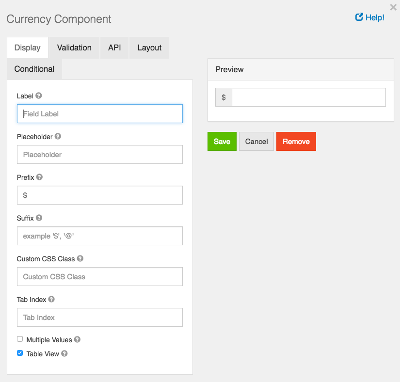

# Currency

The Currency component should be used when a field should display currency amounts on a form. This component holds a numeric input mask that allows two decimal values and automatically adds commas as a user inputs a currency amount.

## Label

The name or title for this component.

## Placeholder

The placeholder text that will appear when this field is empty.

## Prefix

The text to show before a field. An example is ‘$’ for money

## Suffix

The text to show after a field. An example would be ‘lbs’ for weight.

## Custom CSS Class

A custom CSS class to add to this component. You may add multiple class names separated by a space.

## Tab Index

Sets the tabindex attribute of this component to override the tab order of the form. See the MDN documentation on tabindex for more information on how it works.

## Multiple Values

If checked, multiple values can be added in this field. The values will appear as an array in the API and an “Add Another” button will be visible on the field allowing the creation of additional fields for this component.

## Table View

If checked, this value will show up in the table view of the submissions list.
