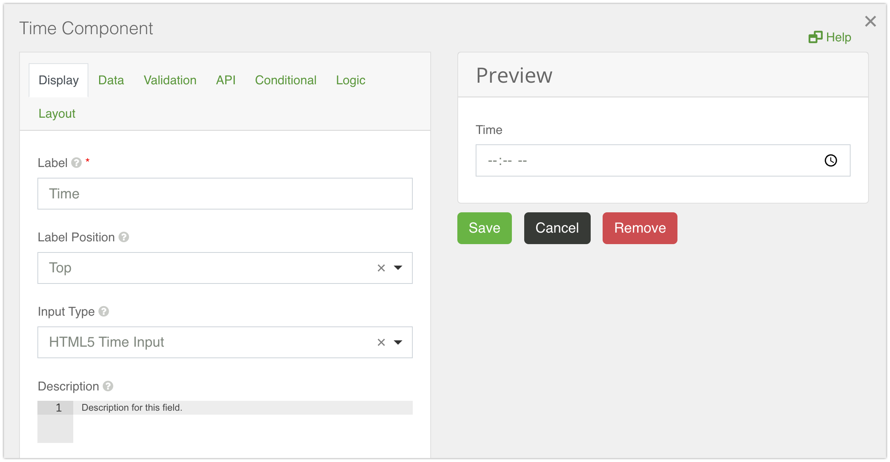
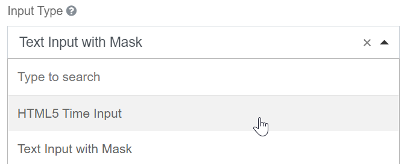

# Time

The Time component can be used to input time using different time widgets you would like to use.

## Input Type

The type of Time widget can be selected between HTML5 Time Input and Text Input with Mask.

