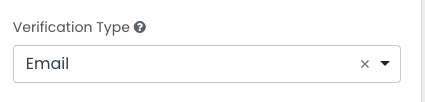

# Verify phone/email

This component is used to get a verified phone number or email address for the user by calling an api which sends
a verification code to the user. The user then enters the code into the input field to verify their phone number or email address.

Select the type of verification desired:

### Display
Some display options are relevant dependong on the type of verification selected. The options are:
#### Email
Input Mask and Input Mask Placeholder are ignored.
#### Phone
Input Mask and Input Mask Placeholder can be used to format the phone number.
### Validation
Validation of the phone number or email address is done by the component to ensure that the user can only send valid input (it is of course up 
to the user to input their own email or phone). Generally, the only validation option that CMs will use is the "Required" option.
### Special Use Case:
In the case where the user must submit a contact requires some special handling.
- **Neither is required**: Nothing special — Leave "Required" unchecked in both components.
- **Both are required**: Nothing special — Select "Required" in both components.
- **Only One Required**: when user must submit only one of the two types…
  - Leave "Required" unchecked in both components.
  - Copy and past the following code into "Custom Validation", making this change:
    - set `otherKey` to the API key of the other component — _important!_
    - `errorMsg` never appears b/c usual validation is done by the component, but a string value is required by FormIO.
    - in other words, the only thing the CM should change is `'phone'`.

`````
var otherKey = 'phone';

var thisValue = data[component.key];
var otherValue = data[otherKey];
valid = thisValue || otherValue ? true : 'errorMsg';


