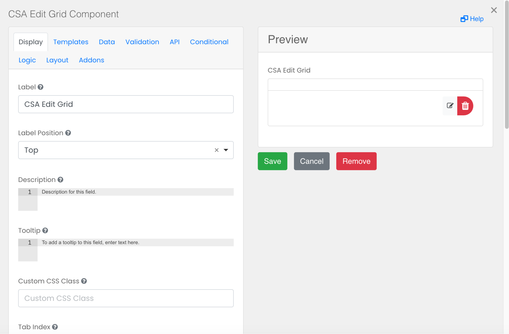

# CSA Edit Grid

The CSA Edit Grid replicates a table-like structure when it comes to the capture and display of form data. Users can add multiple components inside the Edit Grid. Additionally, any number of grids can be added within a form, which is especially useful when needing the ability to add or duplicate multiple fieldsets. There is also flexibility in how the Edit Grid data rows are saved and displayed to the end user. 

## Grid Key

Enter the API key of the data grid component.

## Fields

Enter the data fields to be displayed separately by commas(no spaces).

## Field Titles

Enter the titles for the data fields separated by commas(no spaces).

