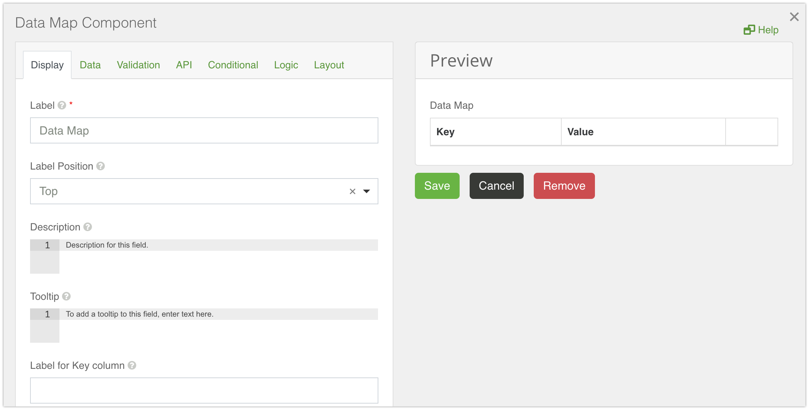

# Data Map

A Data Map component allows users to create key / value pairs. Both the key and the value fields can get the values while filling out the form. New pairs can be added to the form by the 'Add Another' button, and removed by the 'X' (Remove Row) button.
The Data Map with the dataMap key would submit as

```
{
 data: {
    dataMap {
      key: "Kuhn - Kshlerin"
      key1: "Keebler, Brown and Lind"
      key2: "Franecki, Lehner and Prohaska"
    }
  }
}
```

Below is a list of the main settings of the Data Map component.



The Key component cannot be changed and will always be a Text Field. The Value component can be changed from the default Text Field to any other component (e.g. Text Area, Number, Checkbox etc.).

## Label for Key Column

A label text for a Key column. If left empty, the 'Key' label will be used by default.

## Disable Adding / Removing Rows

Hides the 'Add Another' and the 'Remove Row' buttons.

## Show Key Column Before Value

Makes the Key column show before the Value column. If unchecked, the Value column will show first.

## Add Another Text

Sets the text of the 'Add Another' button.
