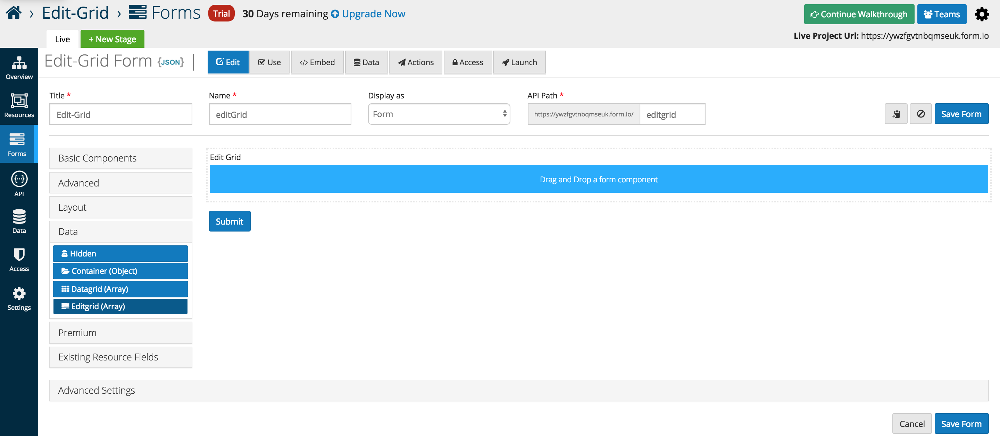
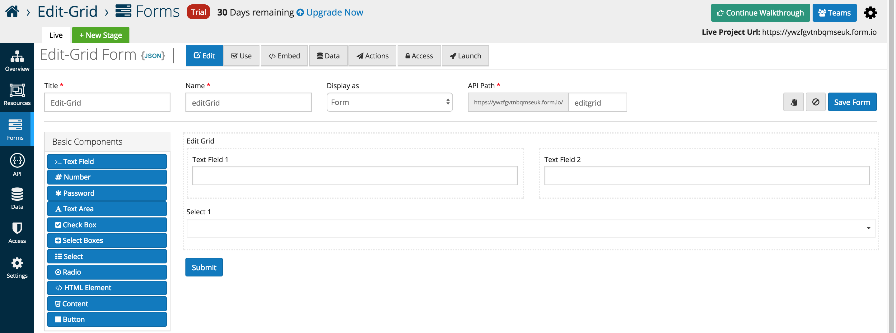
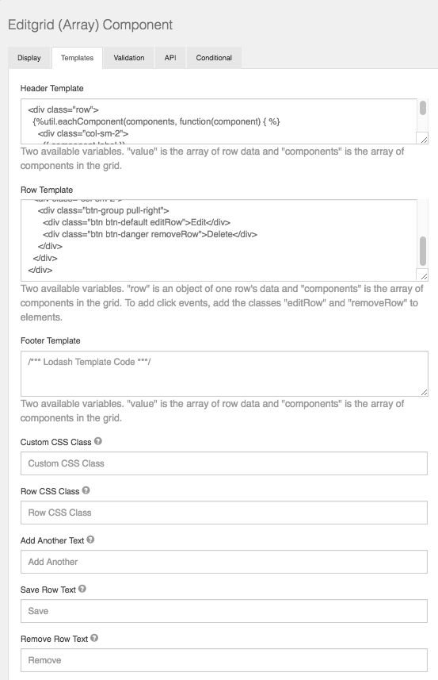
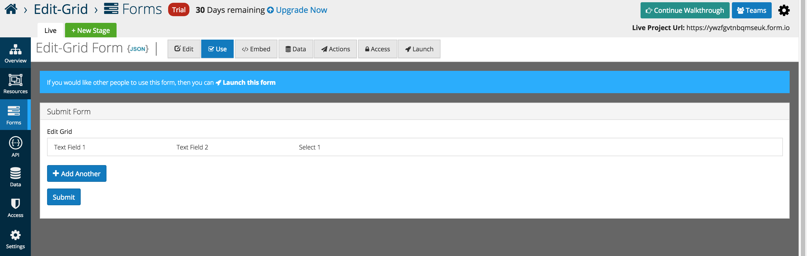
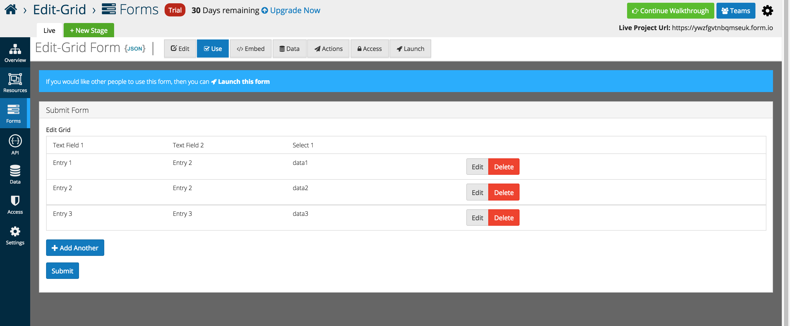
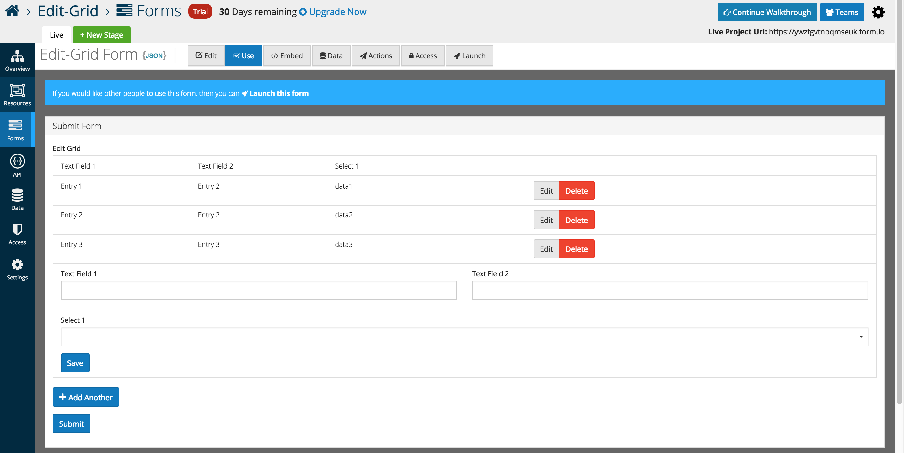
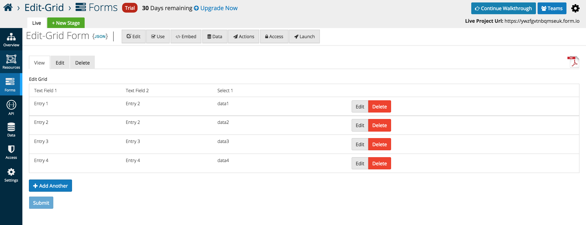

# Edit Grid

Edit Grids allow users to replicate an table like structure when it comes to the capture and display of form data. Users can add multiple components inside of the Edit Grid. Additionally, any number of grids can be added within a form which is especially useful when needing the ability to add or duplicate multiple fields sets.

From the Data component menu, add the Edit Gird (Array) to any active form. By default the grid is empty but can have other form components placed inside.

The example below illustrates three Basic Components placed inside of a Edit Gird (Array). Layout components can be used to replicate the split view below, and additional rows are added automatically when additional form elements are dragged into the interface.

Below is an in depth look at the specific data grid options that users can add or interface with as of the 5.0.0 release

## Templates

Edit Grid gives the user the flexibility to customize the grid to how they see fit using basic JavaScript. Within the Template section of the component settings, the user can modify what type of components are displayed within the grid row along with the Header/Footer.

## Row CSS Class

CSS class to add to the edit row wrapper.

## Add Another Text

Set the text of the Add Another button.

## Save Row Text

Set the text of the Save Row button.

## Remove Row Text

Set the text of the remove/delete Row button.

An example of the Edit Grid displayed in the Use tab.

As Entries are added the table displays the data below each respective header independent of the form layout.

The form layout is displayed when Add Another is pressed, and the form appears below the grid for user entry.

Once submitted, form data can be viewed and edit via traditional platform methods.

