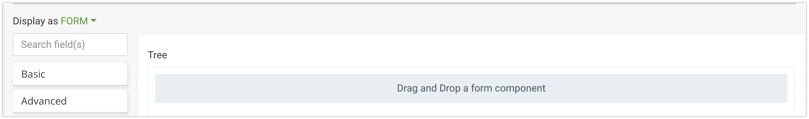
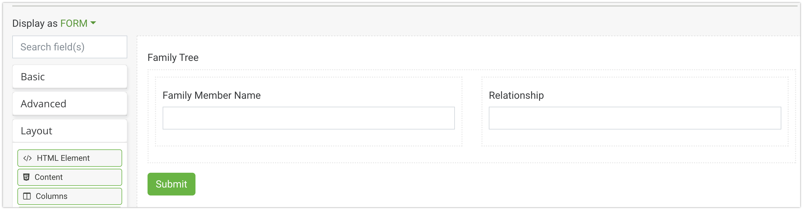
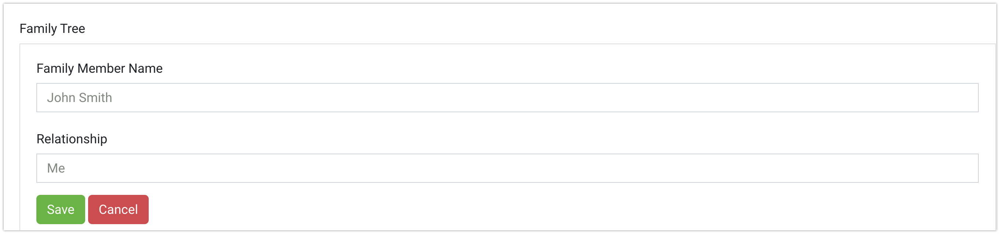
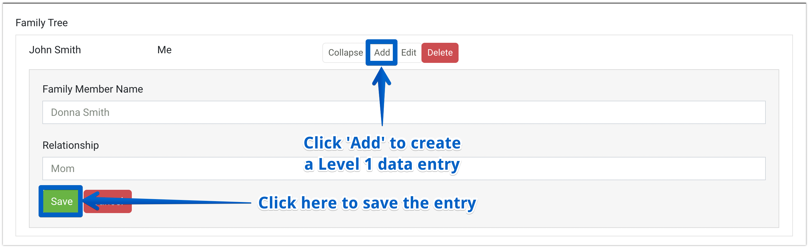
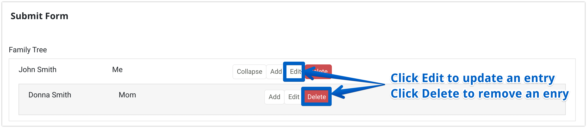
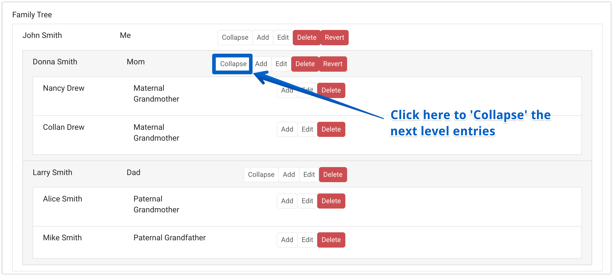
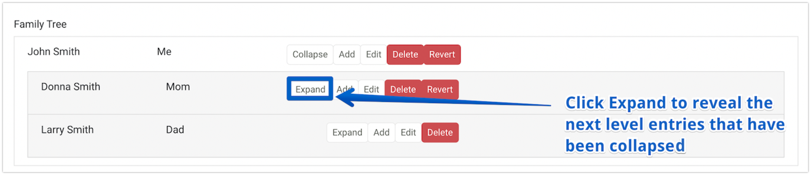
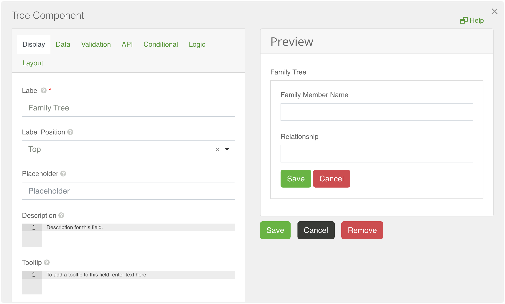

# Tree

A Tree component is very similar to the Edit Grid component. It replicates a table like structure when it comes to the capture and display of form data. But, in comparison with the Edit Grid, the Tree component creates a tree like pattern where users can create a numerous number of data branches. There can only be one top level data entry - a root data entry, which is followed by level 1 data branches, which then are followed by level 2 data branches and so on.

By default, the component is empty, but can have other form components placed inside.

The example below illustrates four components placed inside the Tree. Layout components can be used to replicate the split view below, and additional rows are added automatically when additional form elements are dragged into the interface.

The example below shows the Tree component in the rendered form. The form layout is displayed when initialized, by default. Once filled in, click the 'Save' button to save the top level data entry.

When the form is saved, the root data entry is added to the table.
To add a level 1 data entry, press the 'Add' button next to the root data entry, and the new form layout will open then for filling in. Once filled in, it will display as a branch below the root entry. The same way it works for any other levels of data entries.

When the form is saved, the level 1 data entry is added to the table as a branch entry stemming from the top level entry.
If you want to edit any data entry, just press the 'Edit' button next to the data entry you want to edit. It will turn to the form layout, which can be edited then.
If you like to delete any data entry, press the 'Delete' button next to that data entry.

For convenience matter, when the number of data entries is quite big, you can collapse them by pressing an appropriate button next to the parent data entry.

When you want to show them again, press the 'Expand' button next to a corresponding parent entry.
If you edit data of one of the entries and save the changes, you will see the 'Revert' button next to that data entry. When pressed, the changes will be reverted.

Below is a list of the main settings of the Tree component.

