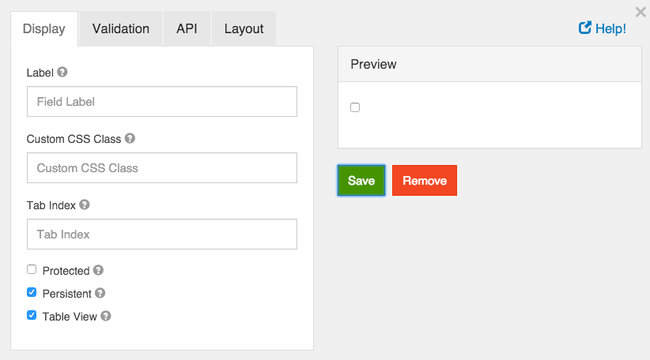
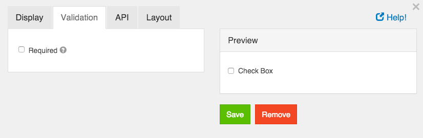

# Check Box

A check box is a boolean value input field. It will either be on or off.

## Label

The label for this field that will appear next to it.

## Custom CSS Class

A custom CSS class to add to this component. You may add multiple class names separated by a space.

## Tab Index

Sets the tabindex attribute of this component to override the tab order of the form. See the MDN documentation on tabindex for more information on how it works.

## Protected

If checked, this field is for input only. When being queried by the API it will not appear in the properties and also should not appear in exported data. You won’t be able to see the value on form.io, but it will be stored in database under the hood.

## Persistent

If checked, the field will be stored in the database. If you want a field to not save, uncheck this box. This is useful for fields like password validation that shouldn’t save.

## Table View

If checked, this value will show up in the table view of the submissions list.

## Required

If checked, the field will be required to be checked. If it is required, you may not need to persist the value as it can be assumed to be checked when a form was submitted or it will not submit.
