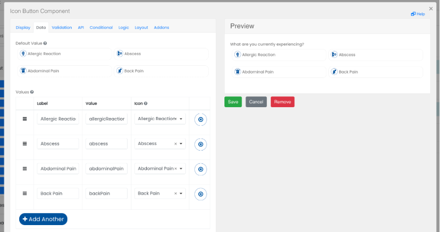

# Icon Button

The Icon Button Component is similar to the Radio Button component, but also allows an icon to be specified for the choice.

## Maximum number of columns

Sets the maximum number of columns to be shown on wide displays.

## Icon

Sets the icon to be used for the choice.
