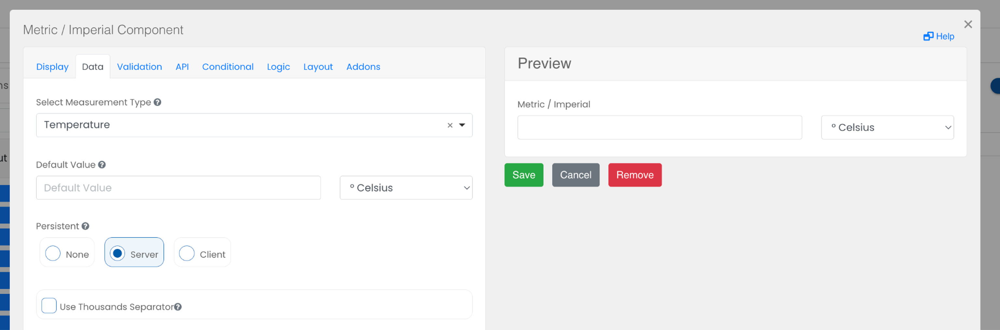

# Metric / Imperial

The Metric / Imperial component allows a number value to be input for common unit conversions between metric and imperial systems.

## Set Measurement Type

Configure the type of measure. The available types are Temperature (Celsius, Fahrenheit), Length (Centimeters, Feet|Inches), Weight (Kilograms, Pounds), Volume (Millilitres, Ounces).

