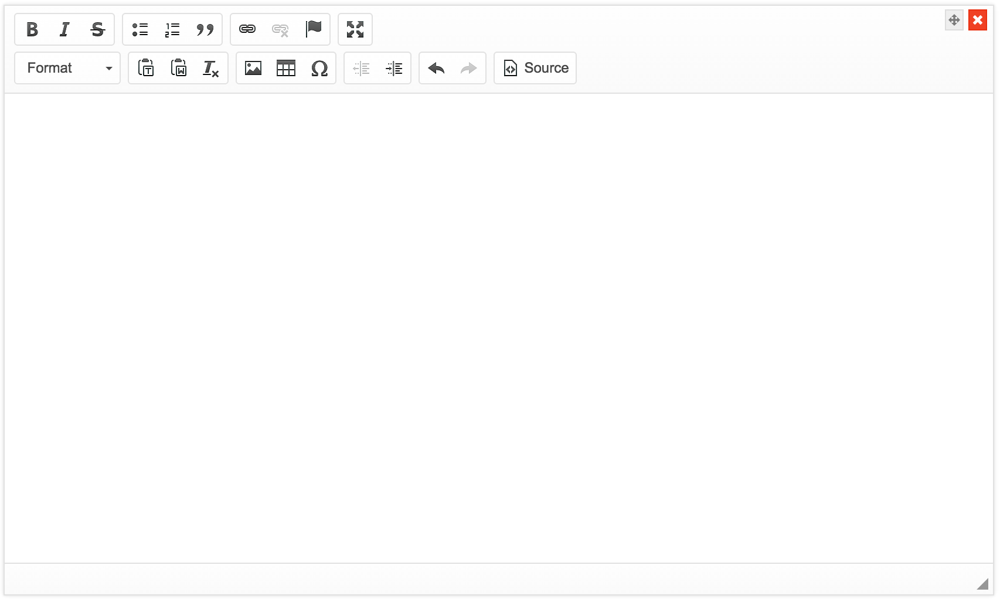

# Content

Content may be added to a form to provide non-field information. For example, if you need instructions at the top of a form that are for display only, use a Content component. There are no settings for a Content component and the value is not submitted back to the server.

A WYSIWYG editor has been provided to help with formatting the content. If you use the HTML view of the editor, note that all unsafe HTML is stripped before rendering to prevent cross-site scripting exploits. This includes tags like `<script>`, `<embed>`, and `<style>`, and attributes like onmouseover or.

## Typography

A Content Manager is able to add styling to the text. Following is the typography guide for the contents that can be added to a from using content component 

* Standard headings should use **Heading 3** in the format dropdown in order to look consistent with the rest of the app
* Standard text should use **Paragraph** 

