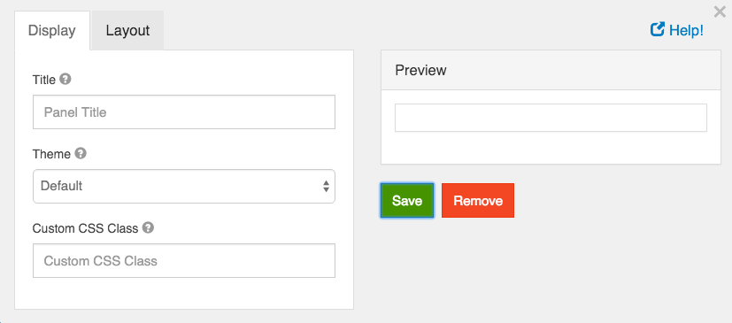

# Panel

Panels are used to wrap groups of fields with a title and styling. These currently map to Bootstrap Panels.

## Panel Title

Enter the panel title that will be displayed at the top of the panel.

## Theme

The theming of the panel. Select one of the options to have the class added to the wrapper div.

## Custom CSS Class

A custom CSS class to add to this component. You may add multiple class names separated by a space.
