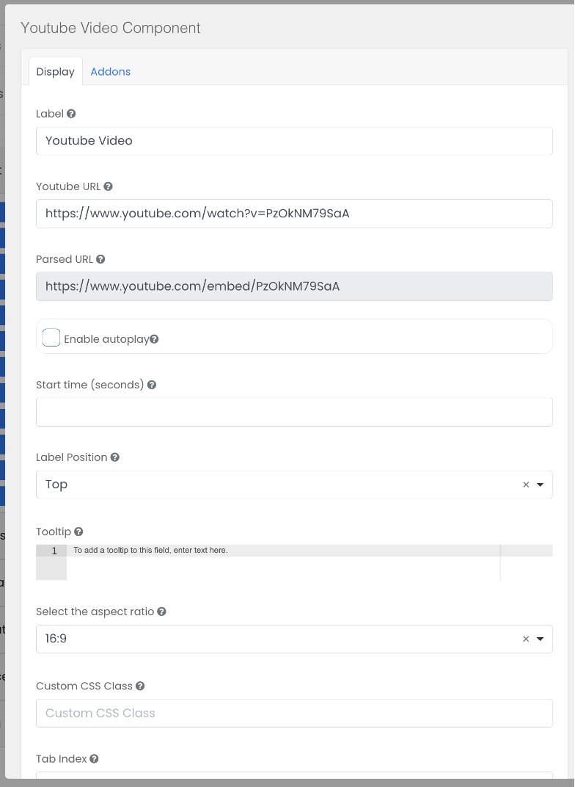

# Youtube Video

The Youtube Video component is used to embed YouTube videos within the form.

## Youtube URL

Paste in the URL of the Youtube video. 

## Enable autoplay

Autoplay can be turned on to play the video without. This feature only works on the Healix progressive web app, not the browser.

## Select aspect ratio

Set the aspect ratio of the video (4:3 or 16:9).

