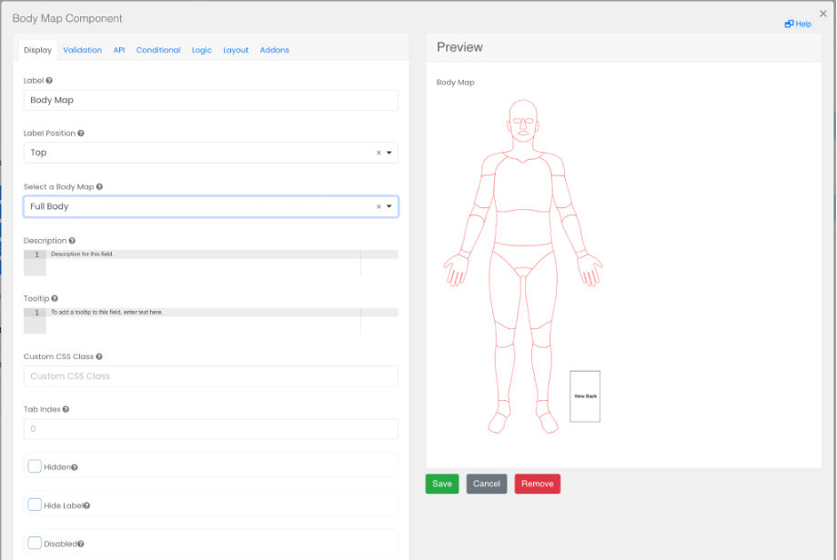

# Body Map

Displays an outline of the human body, allowing the user to select from one or more parts; which is useful for tracking symptoms.

 

## Select a Body Map

Pick the type of body map to use (Full body, Face, Body and Face).

## Select only one part

Choose this option to limit the selection to only one body part.

