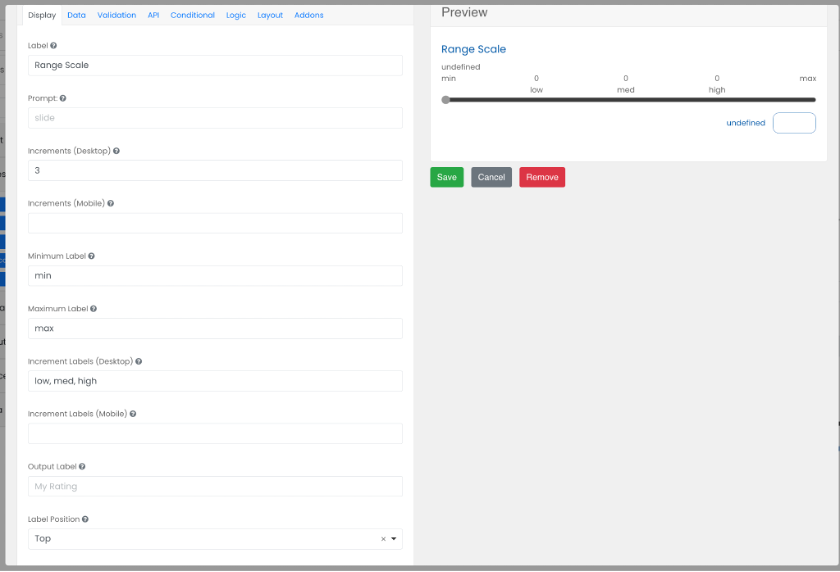

# Range Scale

Horizontal range scales can be added to the form. This component has more customization options than the vertical scale.

 

## Increments (Desktop / Mobile)
The number of increments between the maximum and minimum values (not counting max/min values), which may be different for desktop or mobile users.

## Increment Labels (Desktop / Mobile)

The labels for the increments, which may be different for desktop or mobile users.

## Minimum Label

Add a label for the lowest end of the scale.

## Maximum Label

Add a label for the highest end of the scale.

## Output Label

Add a label for the actual user selected value.

