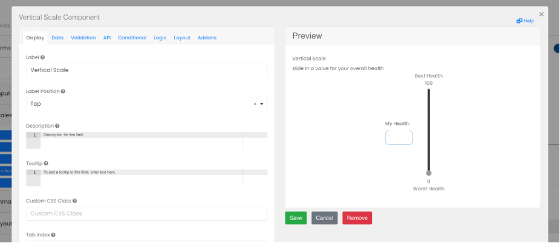

# Vertical Scale

Vertical scales can be added to the form to allow users to enter number values from 0 - 100 with a vertical slider.

## Label: Worst Health (0)

Add a label for the bottom end of the scale (0).

## Label: Best Health (100)

Add a label for the top end of the scale (100).

## Output Label

Add a label for the actual user selected value between 0 - 100.

