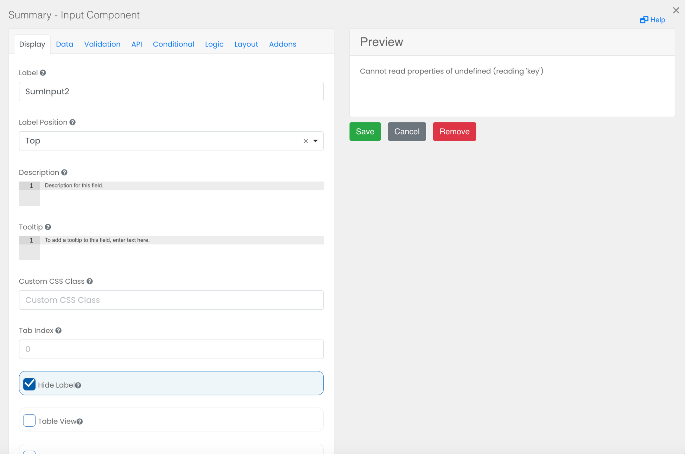

# Summary - Input

The Summary - Input component is used to summarize responses entered in a form. 

 

# Previous Form Key

Enter the name of the previous form for summary(If the summary needs to be added from another form). 
Fields

Enter the data fields to be displayed separately by commas(no spaces).

# Field Titles
Enter the titles for the data fields separated by commas(no spaces).

 

