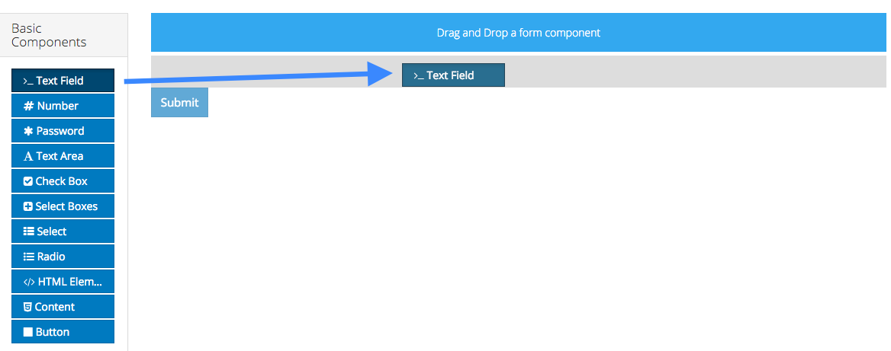

# Core Form Editor (form.io)

Documentation is also available at [form.io](https://help.form.io/userguide/forms), but it discusses many features that are not relevant.

## Adding Form Components

To add a form component to a form, drag and drop the component from the left column into the desired location within the form.

Each new form starts with a submit button automatically added to it. This can be removed or edited as necessary.

