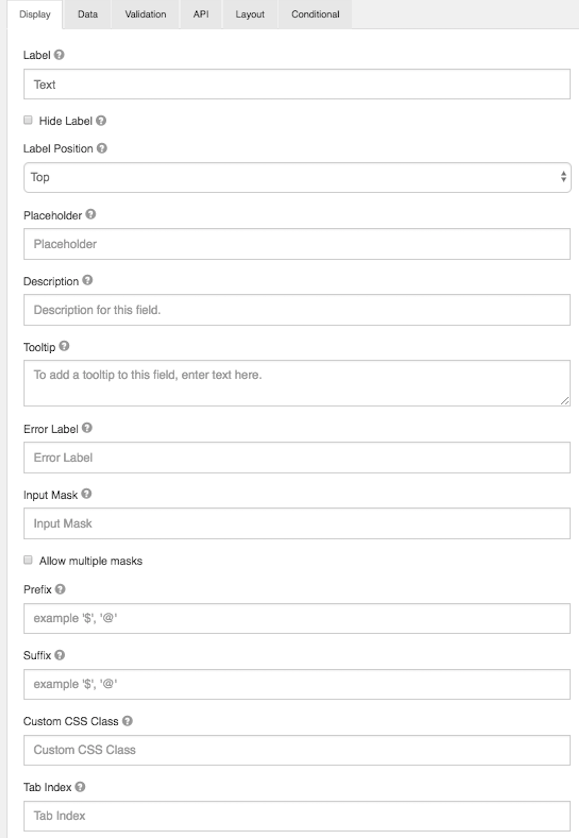
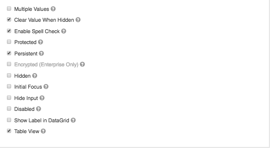

# General Settings

Below is a list of general settings that are offered for the majority of our components.

## Label

The name or title for this component.

## Hide Label

Hide the label of this component. This setting will display the label in the form builder, but hide the label when the form is rendered.

## Label Position

Position for the label for this field.

## Label Width

The width of label on line in percentages.

## Label Margin

The width of label margin on line in percentages.

## Placeholder

The placeholder text that will appear when this field is empty.

### Description

The Description is text that will appear below the input field.

### Tooltip

Adds a tooltip icon to the side of this field.

### Error Label

The label that will display for the field when a validation error message is shown.

## Input Mask

An input mask helps the user with input by ensuring a predefined format. For a phone number field, the input mask defaults to (999) 999-9999.

- 9: numeric
- a: alphabetical
- \*: alphanumeric

## Allow Multiple masks

This setting will allow you to set multiple input masks for the field. The mask is selected by the user via a dropdown list and will dynamically switch the mask for the field when selected. This feature is only availabe on our formio.js renderer.

## Prefix

The text to show before a field. An example is ‘$’ for money

## Suffix

The text to show after a field. An example would be ‘lbs’ for weight.

## Custom CSS Class

A custom CSS class to add to this component. You may add multiple class names separated by a space.

## Tab Index

Sets the tabindex attribute of this component to override the tab order of the form. See the MDN documentation on tabindex for more information on how it works.

## Multiple Values

If checked, multiple values can be added in this field. The values will appear as an array in the API and an “Add Another” button will be visible on the field allowing the creation of additional fields for this component.

## Enable Spell Check

This setting will enable spell check on the field.

## Protected

If checked, this field is for input only. When being queried by the API it will not appear in the properties. You can still see the value on form.io by viewing the form submissions.

## Persistent

If checked, the field will be stored in the database. If you want a field to not save, uncheck this box. This is useful for fields like password validation that shouldn’t save.

## Encrypted

Encrypt this field on the server. This is two way encryption which is not be suitable for passwords. This setting is only available on the ‘Enterprise’ project plan.

## Hidden

A hidden field is still a part of the form JSON, but is hidden when viewing the form is rendererd.

## Initial Focus

Make this field the initially focused element on this form when renderered. Only one component on this form or wizard page can carry the Initial Focus setting.

## Hide Input

Hide the input when viewing the form from the front end browser. This does not encrypt on the server. Do not use for passwords.

## Disabled

Disable this field on the form.

## Show Label in DataGrid

Show the label of this component when in a datagrid.

## Table View

If checked, this value will show up in the table view of the submissions list.
