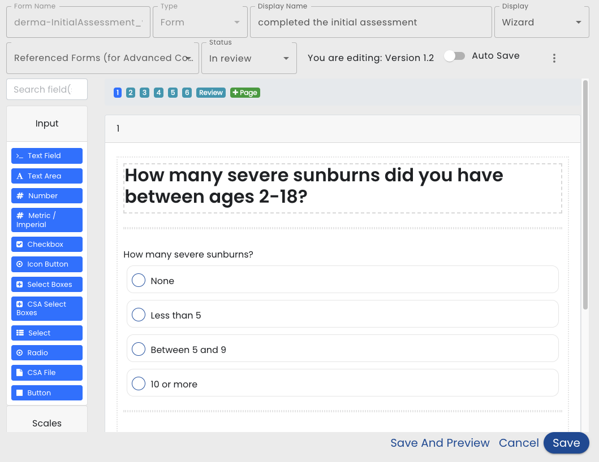

import img from './img/form-display-name.png';
import img2 from './img/form-vs-wizard.png';
import img3 from './img/auto-save.png';
import img4 from './img/view-api.png';
import img5 from './img/reorder-pages.png';

# Form Editor

To creating a form, go to the Forms and Fields tab of a plan template.  (Note, previously forms were created as top level objects and they have moved to be local to a plan.)

**[form.io](https://form.io)** Editing and Displaying forms is done by using  source components [formio.js](https://github.com/formio/formio.js).  Healix wraps the core form feature and customizes it by adding new components and features.

After you create or edit a form the Form Editor is displayed.

**Form Name** - The Form Name is the identifier of the form and should not contain spaces or special characters.

**Type** - Types help categorize the form for easy searching.  Choose from *Form*, *Education* or *Tracker*.

**Display Name** - The text that is displayed on default [Task Cards](/glossary#task-card) and when the form appears on lists

**Display** - Choose *Form* for a standard form or *Wizard* for a form that is broken into pages

**Referenced Forms** - Select forms that will be referenced.

**Status** - IN_REVIEW status forms will only be used in the [Simulator](/creating-plans/simulator/).  ACTIVE status will be used by real users.  As well as changing the status here, the status is also changed when a template that references the form is published (i.e. changing a templates status to ACTIVE also changes any referenced forms to ACTIVE)

**Auto Save** - If this is set to true, then each time the user leaves a field, the field is saved on the server.  This allows them to finish the form at a later time.

**View API** - On the Kebab menu, this choice shows all the fields in the form

**Reorder Pages** - On the Kebab menu, this choice allows you to reorder the pages in a wizard

**Form.io Editor** - the remaining contents is the core form editor from form.io. See [Core Form Editor](form-io-editor) for details.

