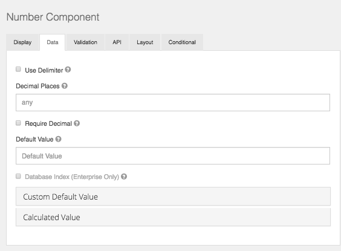

# Number

Number fields should be used whenever a field should be limited to a type of number value.

## Use Delimeter

Check this setting if you would like the value in this component to separate thousands by local delimiter

## Decimal Places

The maximum number of decimal places for the values in this field.

## Require Decimals

Always show decimals for this field, even if trailing zeros.
