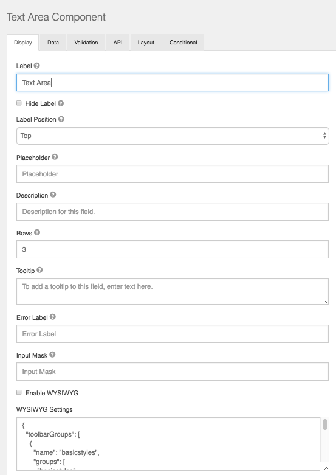

# Text Area

A Text Area has the same options as the textfield form component. The difference is that it will be a multi-line input field that allows for longer text. The Text Area can also be utilized as a CK Editor WYSIWYG for the end user which is configured within the component settings.

## Rows

This allows control over how many rows are visible in the text area.

## Enable WYSIWYG

This setting will turn the Text Area into a user interface WYSIWYG using the famous CK Editor.

## WYSIWYG Settings

Here you can modify the code base of the wysiwyg to customize the UI specific to your needs.
