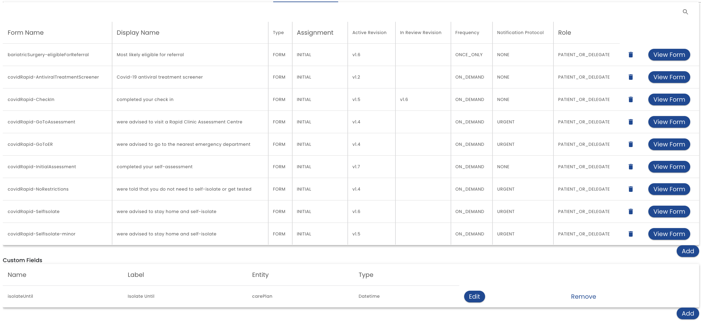

# Forms and Fields

The Forms and Fields tab is where you can incorporate forms into the plan.  You can also define custom fields and inbound [Integration](../../integration) payloads.

When you click the *Add* button, or when you click on a row, the [Form Assignment Editor](form-assignment-editor) is displayed.

