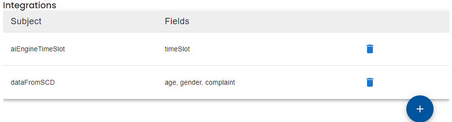
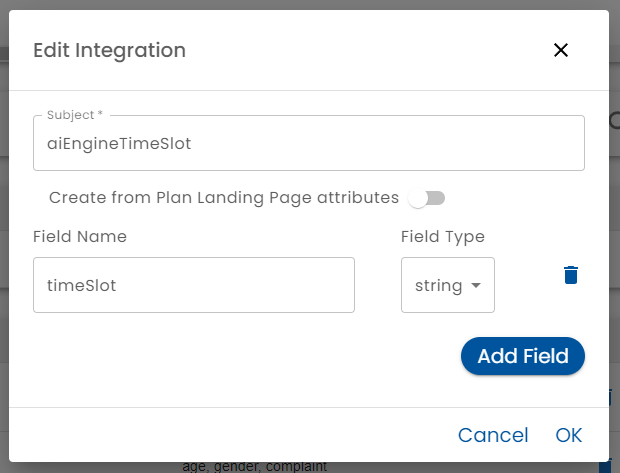

# Integrations

At the bottom of the Forms and Fields tab, there is a section that lists the [integration](../../integration/) events that the plan can respond to.

In some cases, you can also configure integration events to occur.

Adding or editing an integration brings up the Integration Editor.

**Subject** - Enter the subject (also known as topic) that you wish to listen to.  When another system sends events to the integration bus, it specifies a subject.  If the plan is being developed before the system that is being integrated, specify a new subject name and provide it to the other system.  Otherwise, if the system being integrated has already defined the subject, enter it here.

**Create from Landing Page** - When this switch is turned on, Healix will generate an integration event when the an external system sends a user to a plan's [landing page](../presentation/landing-page). The fields you specify below will be picked up from parameters in the  [query string](https://en.wikipedia.org/wiki/Query_string) when the page was loaded.  This allows a third party system to assign a plan to as user and pass information directly to it.

**Fields (Field Name and Type)** - Fields that are included with the integration event payload must be specified.  This allows forms to read values passed in from a third party by using [default calculations](../forms-and-fields/form-assignment-editor.md) or [rules](../rules) are evaluated when an integration event occurs.

:::tip

You can respond to Integrations by defining [Rules](../rules)  Defining the subject and fields here is necessary so that the rules editor "knows" what subjects and fields will be sent to Healix.
