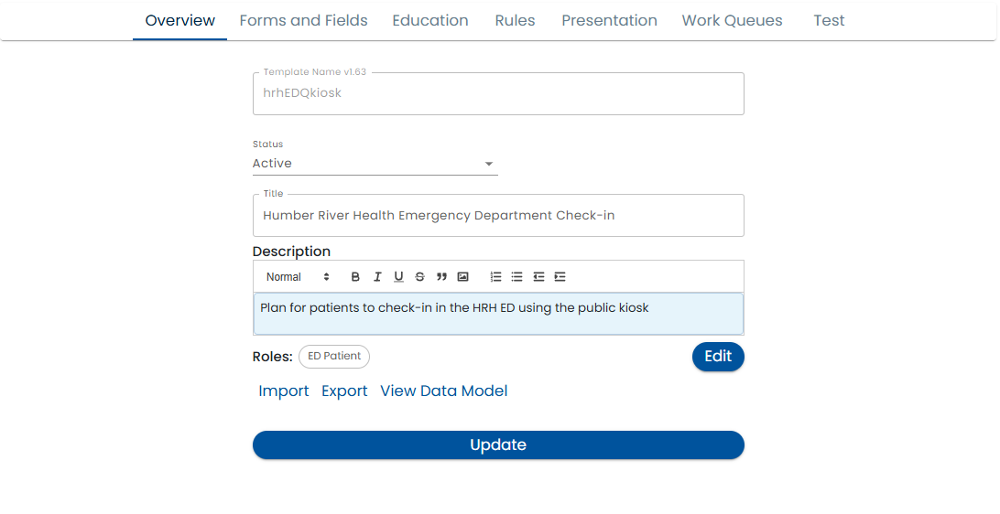

# Overview Tab

The overview tab contains basic information about the plan and lets you perform operations such as importing and exporting templates.

**Status** - If the status is *Active*, then the template is available to be used by administrators and end users. If the status is *In Review* then it is being edited and reviewed by content managers and can only be accessed with the [Simulator](simulator).  When you change the status from *In Review* to *Active* all related forms are also published.  When you edit an *Active* template, a new version number will be automatically created.

**Availability** - If the availability is *Admin*, an administrator must invite end users to participate in a plan.  If the availability is *Unverified*, then any user, even if the system is unsure of their name is able to self sign up and use the plan.

**Title** - The name of the plan template to show to users

**Name** - The system name of the plan template. It should not contain spaces or special characters.

**Description** - The description contains a paragraph or two that describes the purpose of the plan.  You are allowed to use basic formatting such as bolding, italics, indentation, etc.

**Roles** - The roles *Edit* button allows you to define what participant types will be collaborating in the plan.  See [Roles](roles) for more details.

**Import and Export** - These commands allows you to share your template with others or move it from one system to another.

**View Data Model** - This button displays a list of all the data points that where created by the forms fields and custom fields defined in the plan template.  This is useful if you need to reference a data point.  To learn more about the Data Model see the [Dynamic Data Model](../dynamic-data-model).

## Style Guidelines

In order to appear consistent with other parts of the system, use the following styles:

* Description: **Normal** (in the style dropdown)

