 # Charts

A chart defines how data from submitted forms will be displayed.

 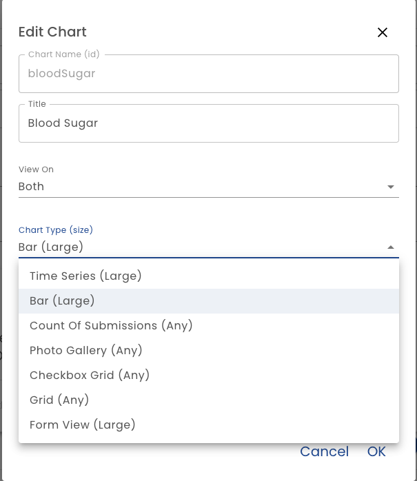 

**Chart Name** - The Chart Name is the identifier of the chart.  It should not contain spaces or special characters.

**Title** - The Title is displayed at the top of the chart

**View On** - You can select if the chart is displayed on mobile, desktop or both.  By default a chart is displayed on both.

**Units of Measure** - Select one or more units of measure to display in the chart.

 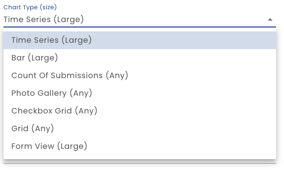

## Time Series

The Time Series options displays charts in a line chart with the date on the X axes.  You can select many units of measure or just one.  When defining a time series chart, select the date field (sort order), the smoothing algorithm applied and grid lines settings.

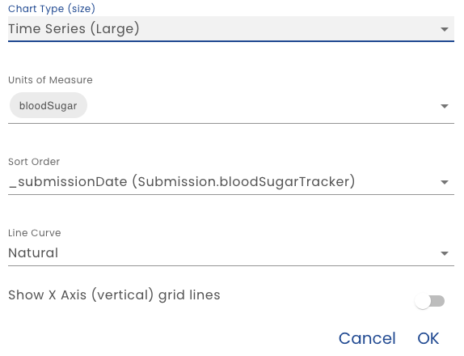
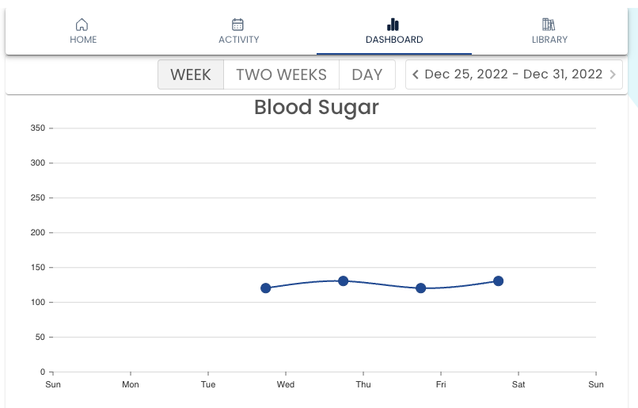

## Bar Chart

When bar chart option is selected, *Grouped* and *Horizontal* may be specified.  The *Grouped* setting determines if the bars show up side by side (as shown below) are stacked.  Use stacked when the sum is interesting. 

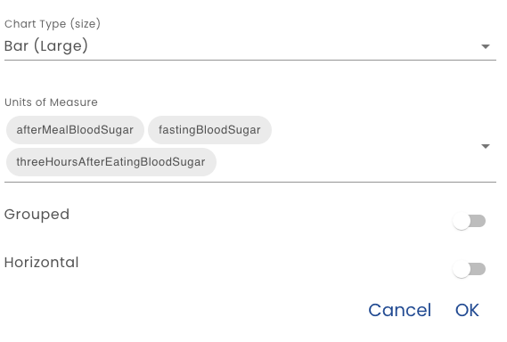

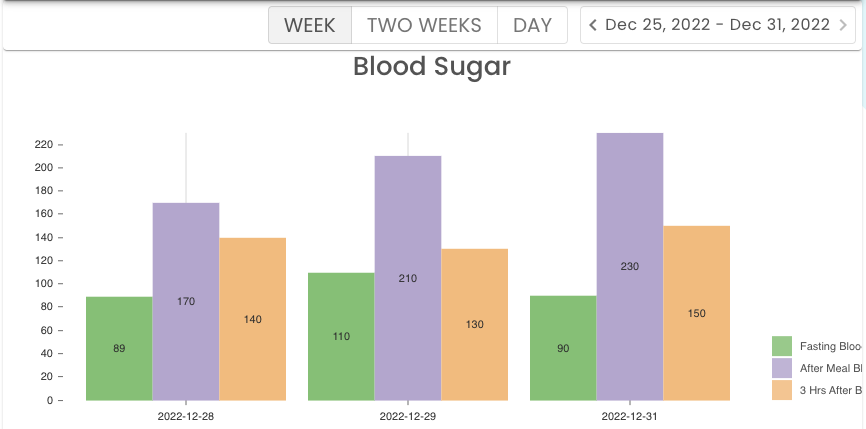

## Submission Count

This simple chart simply displays the number of form submissions made in the selected period.  It is good for demonstrating engagement. Here it is shown with the *Two Charts 1 Big 1 Any* layout.

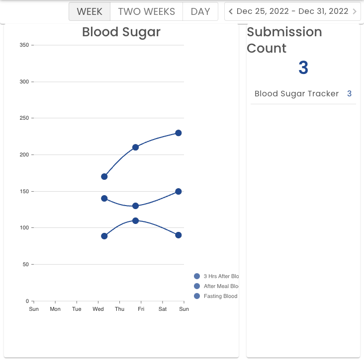

## Photo Gallery

Displaying images uploaded by users can also be done with a chart.  When using a Photo Gallery chart type, also specify the form that contains the image upload feature and the upload field name.  A *Form View* selection allows you to specify text from the same form submission that will be overlaid on the image when the info (i) is clicked. Select a view defined in the [Views](./views) section.

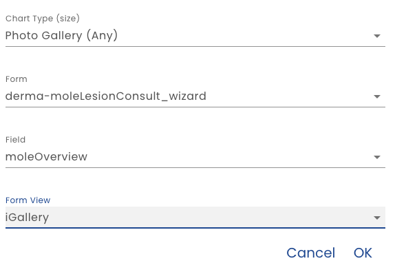

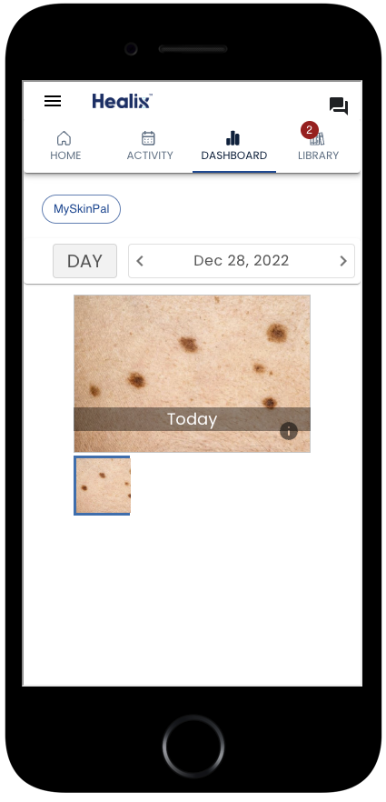
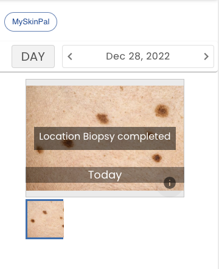

## Checkbox Grid

Configuring a Check Box grid requires that you define a form and field.  The field you select should be a multi select field such as a *Select Boxes* field type that allow a user to select one of many values.

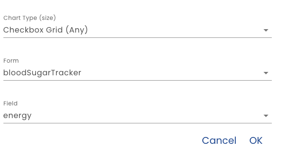

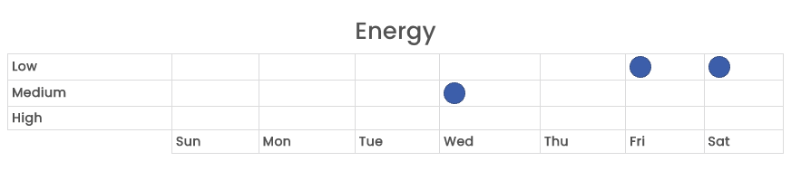
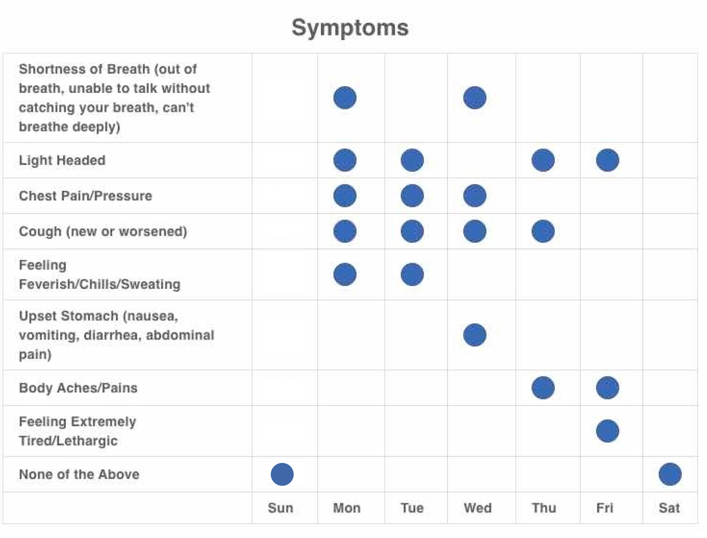 

## Grid

A Grid chart type is a simple table of numbers.  Configuring simple requires selecting the fields to display.

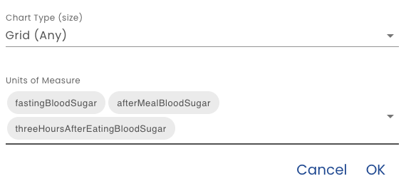

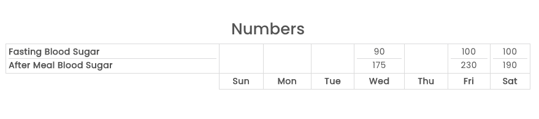

## View

A View allows you to specify a formatted text with data inserted by using [Healix Expression Grammar](/docs/dynamic-data-model/healix-calculation-grammar).  When defining a View chart type, just select the *View* defined in the [Views](./views) section.

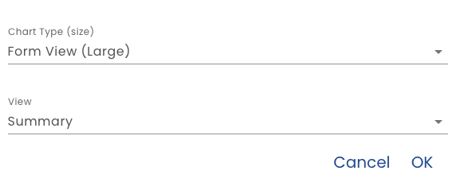

