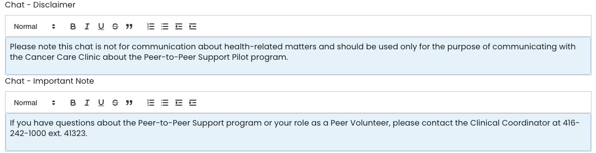
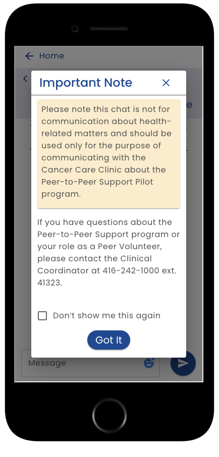

# Chat Disclaimer

The chat tab includes a section for editing the a disclaimer that is shown to the user when they access the chat feature:

**Chat Disclaimer** - Text entered here shows as a highlighted text block.  You can use the formatting features to control the appearance

**Chat Important Note** - Text entered here shows beneath the disclaimer.

For example:

Note that the user has the ability to prevent the disclaimer from being shown a second time.

## Typography Guidelines

In order to appear consistent with the rest of the app, the following styles are recommended:

* Disclaimer Title: **Heading 5** (in style dropdown)
* Disclaimer Details/body: **Normal**
