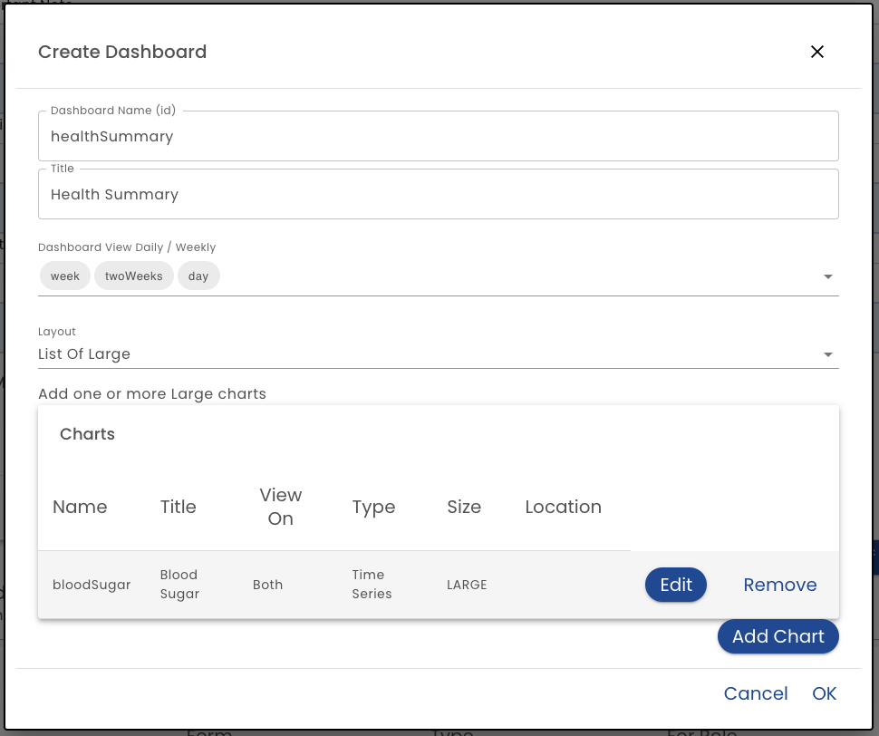
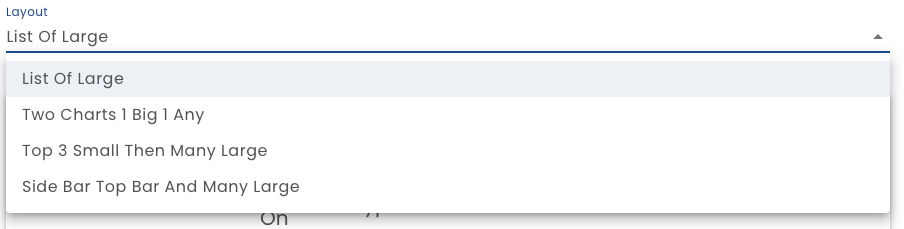

# Dashboards

Charts are placed on a dashboard, so to define a chart you first define a dashboard.

**Dashboard Name*** - The Name is the identifier for the dashboard.  It should not include spaces or special characters

**Title** - The Title is shown at the top of the dashboard.

**View** - Select one or more of *Week*, *Two Weeks* or *Day*.  The user will be able to show the time period of the added options.

**Layout** - The Layout determines how the charts are placed on the dashboard.  Note that Charts have different sizes.  Currently *Large* and *Any* sized charts are supported.  Certain layouts place the charts according to size.

  **List of Large** - The defined charts appear one on top of each other

  **Two Charts 1 Big 1 Any** - This layout is limited to two charts.  The large chart is displayed on the left and the other is displayed on the right on desktop. The large chart is displayed on the top on mobile.

