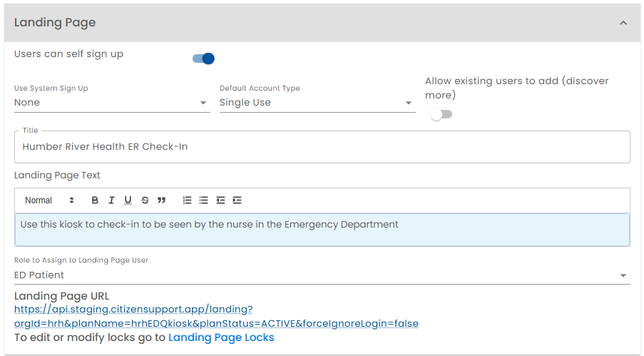

 # Landing Page
 
 A landing page is configured so a plan can be introduced to prospective users and use a sign up flow to create an account and add the plan to their account.

 

*Users can Self Sign Up* - This switch can be turned on or off. If users can self sign up and the following options can be configured:

*Use System Sign Up* - This option can be "Contact Optional", "Contact Required", or "None".

  * *Contact Optional* - The Healix sign up screens are used to create an account.  Users can self sign up without providing any contact information such as an email address.
  * *Contact Required* - The Healix sign up screens are used to create an account.  Users are required to provide an email address.
  * *None* - The Healix sign up screens are not displayed. If user profile information is required, the Content Manager must collect this information using forms and write the information to the user's profile using rules.

*Default Account Type* - This option can be "Normal", "Single Use" or "Single Use Invite".

  * *Normal* - A normal account is created and the plan is added to the account. Users are aware of having a Healix account. This option is only available if *Use System Sign Up* is set to *Contact Required*.  This option is useful if you want to engage users of the plan being configured with different plans.
  * *Single Use* - A single use account is created and the plan is added to the account. Users are not aware of having a Healix account. This option is only available if *Use System Sign Up* is set to *Contact Optional* or *None*.  When using the system, the user interface will not offer a choice to Sign Up for Healix.  This option is useful, if you the simpliest sign up process possible and do not want to engage users with the idea of having a Healix account.
  * *Single Use Invite* - A single use account is created and the plan is added to the account. Users are not aware of having a Healix account. This option is only available if *Use System Sign Up* is set to *None*.  When using the system, the user interface will not offer a choice to Sign Up for Healix.  This option is useful, if you the simpliest sign up process possible and do not want to engage users with the idea of having a Healix account.

  Single use accounts are automatically archived after their initial use.  

*Allow existing users to add plan* - This switch can be turned on or off.  If turned on, existing users can add the plan to their account.   If a user is already logged in and reaches the landing page, the landing page will not offer a choice to add the plan to their account.  Also, the plan appears on the "Discover More" page inviting existing Healix users to add the plan to their account.

*Title* - The title of the Landing Page shown to the users visiting the landing page.

*Landing Page Text* - Text shown to visitors of the landing page and on the "Discover More" page.

*Role to Assign* - If a user visiting the landing page elects to use the plan, they are assigned to role specified here.

*Landing Page URL* - The URL of the landing page. This value is computed and up can click on the link to go to the published (Active) version of the landing page.  The [simulator](../simulator/) allows you to preview a landing page before it is published.
