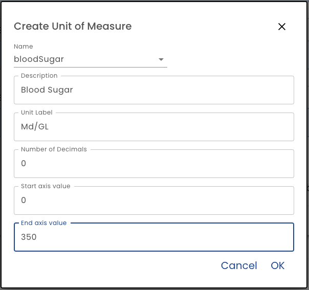

# Units of Measure

Before creating a chart and dashboard, you first must define a *Unit of Measure* for any numeric fields being charted.

**Name** - First enter the name of the Unit of Measure. As of this writing, the Unit of Measure is a dropdown of all numeric fields used in the forms that have been used in the Plan Template.  See the [Roadmap](/roadmap#units-of-measure) for more details.

**Description** - This is the label that will be used when displaying the unit of measure. (For example on chart legends).

**Unit Label** - This is the label that applies to the number.  For example kg, cm, etc.

**Number of Decimals** - When formatting the number for display, how many decimal places should be used

**Start Axis Value** - When charting the unit of measure, enter the lowest value that should be accounted for.

**End Axis Value** - When charting the unit of measure, enter the highest value that should be accounted for