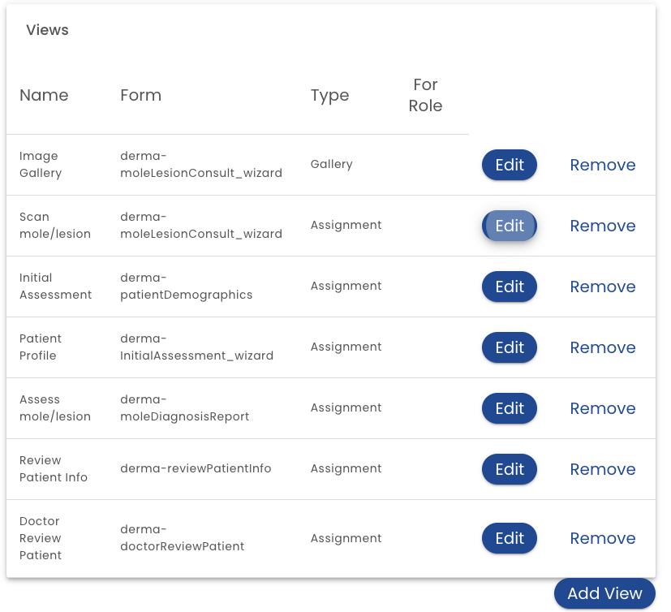
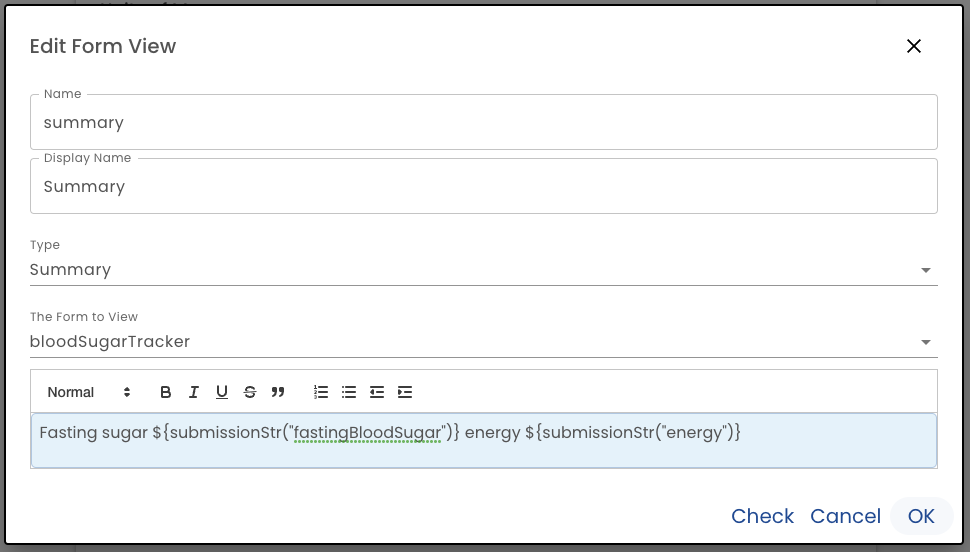
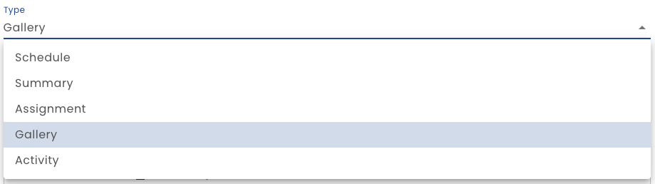

 # Views

Views are formatted text (e.g. with bolding, italics etc) that can optionally insert values from the system.  These inserted values are created with the [Healix Expression Grammar](/dynamic-data-model/healix-calculation-grammar).  Views can be used in a variety of places such as overriding the default task for submission cards.

The Views section of the Presentation tab includes a list of views.

The *Add View* button creates a new view or you can click the *Edit* button to modify.

**Name** - Name is the identifier of the view and should not contain spaces or special characters.

**Display Name** - This name is used when the name of the view is displayed.

**Type** - Select the view type:

* **Schedule** - Schedule views are used when displaying a schedule.  When a plan has schedule views defined, the Schedule tab will appear on the user's profile.
* **Summary** - A general purpose form view
* **Assignment** - Assignment views are used to override the text displayed on a [Task Card](/glossary.md#task-card)
* **Gallery** - Views used in photo gallery
* **Activity** - Used to display a form submission card (on the Activity Tab)

**Form to View** - If the has a form in context (see below), then you may select which form is being viewed

**Text Area** - The text area defines the actual view. Standard formatting tools can be used to format the text. In order to access the [Healix Expression Grammar](/dynamic-data-model/healix-calculation-grammar) to compute values, use the ${ to start an expression and } to complete the expression as shown above

## View Contexts

When a view is computed it has access to certain data. Depending on the view type, some data will be available depending on this context.

For example, if a submission is in context, the Form View may pick up values from that form submission (using the submissionVal or submissionStr functions).

If a submission is not in context (e.g. an *Assignment* view which is used on task cards), then attempting to access submission data (with submissionVal or submissionStr) will cause an error.

The following form view have a form submission in context:

* Schedule
* Gallery
* Activity

The following view types do not have a form submission in context:

* Assignment
* Summary

