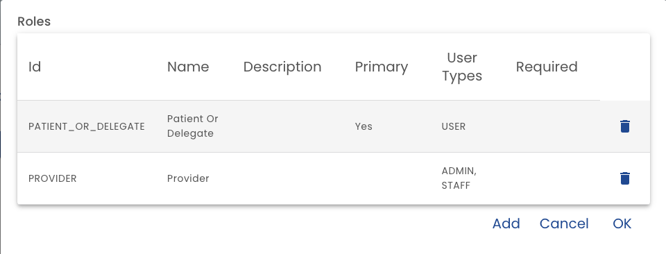

# Roles

Roles are a foundational part of the plan template and defines the responsibilities of the participants.

The roles list allows you to add, edit roles.

You cannot delete a role that already exists in a published template. (Create a new template instead.)  Also, you cannot delete a primary role.  Deleting a role also deletes form assignments for that role. Typically, you only should delete a role that was recently added in error.

